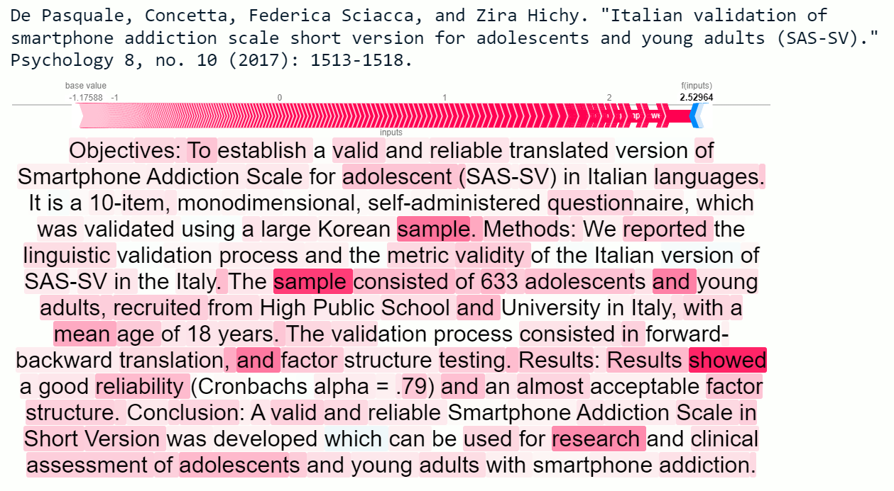
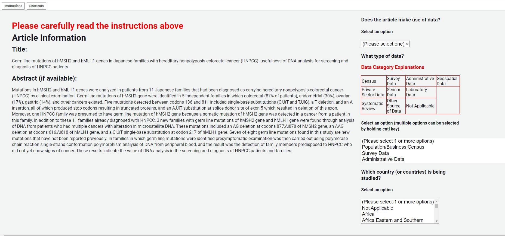

```{r setup, include=FALSE}
knitr::opts_chunk$set(
	echo = FALSE,
	fig.height = 6,
	fig.width = 9,
	message = FALSE,
	warning = FALSE,
	dpi = 350,
	fig.path="./figures/"
)
library(tidyverse)
library(flextable)
library(here)
library(wbstats)
library(dtplyr)
library(data.table)
library(caret)
library(ggrepel)
library(ggpmisc)
library(ggthemes)
library(ggtext)
library(broom)
library(estimatr)
library(sandwich)
library(lmtest)
library(zoo)
library(jsonlite)
library(modelsummary)
library(patchwork)
library(fst)
library(aws.s3)
library(fixest)

dir <- here()
raw_data <- paste0(dir, "/01_raw_data/")
output <- paste0(dir, "/03_output/")
s3_output <- 'https://data-use-academia.s3.amazonaws.com/03_output/'#for the bigger files kept on S3
#article share
#share of articles that have been examined.  Will be used to estiamte total number by country
article_share=11/100

#set lower year for papers
paper_lower_year <- 2000

prim_col <- "#219ebc"
maj_col <- "#023047"
min_col <- "#8ecae6"
```


```{r countryscore, include=FALSE}
#read in world bank country metadata
country_metadata <- wb_countries() %>%
  filter(region!="Aggregates")

#articles_year_df <- fread(paste0(s3_output, "results_completed_updated.csv")) 

#read in data from AWS

tictoc::tic("fst")
articles_year_df <- s3read_using(read.fst,object='s3://data-use-academia/03_output/results_completed_updated_20231003.fst') %>%
  as.data.table()
tictoc::toc()


# tictoc::tic("fst")
# articles_year_df <- s3read_using(feather::read_feather,object='s3://data-use-academia/03_output/results_completed_updated.feather') %>%
#   as.data.table()
# tictoc::toc()

correlate <- c("SP.POP.TOTL","NY.GDP.MKTP.PP.KD",'IQ.SPI.OVRL','NY.GDP.PCAP.PP.KD',
              'IQ.SPI.PIL1','IQ.SPI.PIL2','IQ.SPI.PIL3',
              'IQ.SPI.PIL4','IQ.SPI.PIL5',
              'IQ.SCI.OVRL','NV.IND.MANF.ZS', 'NV.AGR.TOTL.ZS','NE.TRD.GNFS.ZS', 'HD.HCI.OVRL', 'HD.HCI.LAYS',
              'SE.PRM.ENRR','BN.CAB.XOKA.GD.ZS', 'CC.EST', "GE.EST", 'PV.EST', "RQ.EST", "RL.EST", 
              "VA.EST", "BX.KLT.DINV.WD.GD.ZS", "SI.POV.DDAY", "SI.POV.GINI")

correlates_df <- wbstats::wb_data(
  indicator=correlate,
  country = 'countries_only',
  start_date=2000,
  end_date=2020
  ) %>%
  group_by(iso3c) %>%
  mutate(across(correlate,
                ~if_else(is.na(.),1,0),
                .names="{.col}_imp_tag")) %>% #add tag for data that is imputed
  fill(correlate, .direction="downup") %>%
  mutate(WGI.OVL=(CC.EST + GE.EST + PV.EST + RQ.EST + RL.EST + VA.EST)/6
         )  %>%
  ungroup()  %>%
  left_join(read_csv(paste0(raw_data, "/SPI_Index.csv")) %>% select(iso3c, date, starts_with("SPI."))) 
  

countries_list <- colnames(articles_year_df[,27:263])
#get number of articles by country
articles_year_country_df <- articles_year_df[,lapply(.SD, sum, na.rm=TRUE), by=year, .SDcols=countries_list]

articles_year_country_df <- articles_year_country_df %>% 
  as_tibble() %>%
  pivot_longer(
    cols=countries_list,
    names_to = 'iso3c',
    values_to='papers'
  ) %>%
  left_join(country_metadata) %>%
  filter(!is.na(country)) %>%
  group_by(iso3c) %>%
  arrange(desc(year)) %>%
  mutate(papers_estimate=papers/article_share,
         papers_estimate_3yr=rollmean(papers_estimate, k=3, align='left', fill=NA))


#get number of articles using data by country
articles_data_use_year_df <- articles_year_df[data_use=="Yes",lapply(.SD, sum, na.rm=TRUE), by=year, .SDcols=countries_list]

articles_data_use_year_df <- articles_data_use_year_df %>% 
  as_tibble() %>%
  pivot_longer(
    cols=countries_list,
    names_to = 'iso3c',
    values_to='data_papers'
  ) %>%
  left_join(country_metadata) %>%
  filter(!is.na(country)) %>%
  group_by(iso3c) %>%
  arrange(desc(year)) %>%  
  mutate(data_papers_estimate=data_papers/article_share,
         data_papers_estimate_3yr=rollmean(data_papers_estimate, k=3, align='left', fill=NA),
         data_papers_3yr=rollmean(data_papers, k=3, align='left', fill=NA))


#drop medical articles
#get number of articles using data by country
articles_data_use_year_restrict_df <- articles_year_df[data_use=="Yes" & group_name!='Medicine',lapply(.SD, sum, na.rm=TRUE), by=year, .SDcols=countries_list]

articles_data_use_year_restrict_df <- articles_data_use_year_restrict_df %>% 
  as_tibble() %>%
  pivot_longer(
    cols=countries_list,
    names_to = 'iso3c',
    values_to='data_papers_nomed'
  ) %>%
  left_join(country_metadata) %>%
  filter(!is.na(country)) %>%
  group_by(iso3c) %>%
  arrange(desc(year)) %>%  
  mutate(data_papers_nomed_estimate=data_papers_nomed/article_share,
         data_papers_nomed_estimate_3yr=rollmean(data_papers_nomed_estimate, k=3, align='left', fill=NA),
         data_papers_nomed_3yr=rollmean(data_papers_nomed, k=3, align='left', fill=NA))


#get number of articles using data by country and subject
articles_data_use_year_subject_df <- articles_year_df[data_use=="Yes",lapply(.SD, sum, na.rm=TRUE), by=c('year','group_name'), .SDcols=countries_list]

articles_data_use_year_subject_df <- articles_data_use_year_subject_df %>% 
  as_tibble() %>%
  pivot_longer(
    cols=countries_list,
    names_to = 'iso3c',
    values_to='data_papers'
  ) %>%
  group_by(iso3c, group_name) %>%
  arrange(desc(year)) %>%
  mutate(
    data_papers_3yr=rollmean(data_papers, k=3, align='left', fill=NA)
  ) %>%
  left_join(country_metadata) %>%
  filter(!is.na(country)) %>%
  group_by(iso3c) %>%
  arrange(desc(year)) %>%
  pivot_wider(
    names_from=group_name,
    values_from=c('data_papers','data_papers_3yr'),
    names_glue="{.value}_{group_name}"
  )


country_scores_annual_df <- articles_year_country_df %>%
  left_join(articles_data_use_year_df)  %>%
  left_join(articles_data_use_year_restrict_df) %>%
  left_join(articles_data_use_year_subject_df) %>%
  filter(!is.na(country)) %>%
  rename(date=year) %>%
  select(-country,) %>%
  left_join(correlates_df) 


country_scores_2019_df <- country_scores_annual_df %>%
  filter(date==2019)

country_scores_aggregate_df <- country_scores_annual_df %>%
  group_by(iso3c, region, income_level, lending_type) %>%
  summarise(papers=sum(papers, na.rm=T),
            papers_estimate=sum(papers_estimate, na.rm=T),
            data_papers=sum(data_papers, na.rm=T),
            data_papers_estimate=sum(data_papers_estimate, na.rm=T),
            data_papers_nomed=sum(data_papers_nomed, na.rm=T),
            data_papers_nomed_estimate=sum(data_papers_nomed_estimate, na.rm=T),
            data_papers_Medicine=sum(data_papers_Medicine, na.rm=T),
            data_papers_Business=sum(data_papers_Business, na.rm=T),
            data_papers_Economics=sum(data_papers_Economics, na.rm=T),
            data_papers_Psychology=sum(data_papers_Psychology, na.rm=T),
            data_papers_Sociology =sum(data_papers_Sociology, na.rm=T), 
            data_papers_Political_Science=sum(`data_papers_Political Science`, na.rm=T),
            qual_papers=papers-data_papers) %>%
  mutate(date=2020) %>%
  left_join(correlates_df) %>%
  ungroup() %>%
  mutate(data_papers_pcap=1000000*data_papers/SP.POP.TOTL) %>%
  select(country, iso3c, date, region, income_level, lending_type, everything())
  

country_scores_recent_df <- country_scores_annual_df %>%
  filter(between(date,paper_lower_year, 2020)) %>%
  group_by(iso3c, region, income_level, lending_type) %>%
  summarise(papers=sum(papers, na.rm=T),
            papers_estimate=sum(papers_estimate, na.rm=T),
            data_papers=sum(data_papers, na.rm=T),
            data_papers_estimate=sum(data_papers_estimate, na.rm=T),
            data_papers_nomed=sum(data_papers_nomed, na.rm=T),
            data_papers_nomed_estimate=sum(data_papers_nomed_estimate, na.rm=T),
            data_papers_Medicine=sum(data_papers_Medicine, na.rm=T),
            data_papers_Business=sum(data_papers_Business, na.rm=T),
            data_papers_Economics=sum(data_papers_Economics, na.rm=T),
            data_papers_Psychology=sum(data_papers_Psychology, na.rm=T),
            data_papers_Sociology =sum(data_papers_Sociology, na.rm=T), 
            data_papers_Political_Science=sum(`data_papers_Political Science`, na.rm=T),
            qual_papers=papers-data_papers) %>%
  mutate(date=2020) %>%
  left_join(correlates_df) %>%
  ungroup() %>%
  mutate(data_papers_pcap=1000000*data_papers/SP.POP.TOTL) %>%
  select(country, iso3c, date, region, income_level, lending_type, everything())

ncontry_database<-country_scores_aggregate_df %>% filter(papers>0) %>%
  nrow()

not_found <- country_scores_aggregate_df %>%
  filter(papers==0 | is.na(papers)) %>%
  filter(region!="Aggregates") %>%
  pull(country)
```

```{r mturkdata, include=FALSE}


# #read in country scores based on collapsing articles in mturk
# #This file was produced in the classifications_compare.ipynb in the 02_programs/misc file.
# country_score_mturk_df <- read_csv(paste0(output, "mturk_country_scores.csv")) %>%
#   rename(iso3c=index) %>%
#   left_join(country_metadata) 

#read in articles in the training set
training_df <- read_csv(paste0(raw_data,"/train_doc_wcounts.csv")) %>%
  rename(paper_id=id) %>%
  distinct(paper_id, text, .keep_all=TRUE) %>%
  as.data.table()

testing_df <- read_csv(paste0(raw_data,"/test_doc_wcounts.csv")) %>%
  rename(paper_id=id) %>%
  distinct(paper_id, text, .keep_all=TRUE) %>%
  as.data.table()


############
# read in all mturk articles
mturk_articles_df <- read_csv(paste0(output,'/mturk_article_classifications.csv')) %>%
  as.data.table() %>%
  distinct(paper_id, .keep_all=TRUE) %>%
  left_join(articles_year_df[,.(paper_id, data_use)] ) %>%
  left_join(training_df) %>%
  filter(!is.na(paper_id)) %>%
  filter(!is.na(data_use)) %>%
  filter(is.na(data_type)) %>% #drop those in train set of articles
  as.data.table()

#drop the training set from conmparison


# mturk_articles_df %>%
#   group_by(data_use) %>% 
#   summarise(n=n())

countries_list <- colnames(mturk_articles_df[,19:156])
#get number of articles by country using mturk classifier
mturk_year_country_df <- mturk_articles_df[data_use_mturk==1,lapply(.SD, sum, na.rm=TRUE), by=year, .SDcols=countries_list]

mturk_year_country_df <- mturk_year_country_df %>% 
  as_tibble() %>%
  pivot_longer(
    cols=countries_list,
    names_to = 'iso3c',
    values_to='data_use_mturk_papers'
  ) %>%
  left_join(country_metadata) %>%
  filter(!is.na(country)) %>%
  group_by(iso3c) %>%
  arrange(desc(year)) 


#get number of articles by country
class_year_country_df <- mturk_articles_df[data_use=="Yes",lapply(.SD, sum, na.rm=TRUE), by=year, .SDcols=countries_list]

class_year_country_df <- class_year_country_df %>% 
  as_tibble() %>%
  pivot_longer(
    cols=countries_list,
    names_to = 'iso3c',
    values_to='data_use_class_papers'
  ) %>%
  left_join(country_metadata) %>%
  filter(!is.na(country)) %>%
  group_by(iso3c) %>%
  arrange(desc(year)) 

#put in one file
mturk_articles_year_df <- mturk_year_country_df %>%
  left_join(class_year_country_df)


country_score_mturk_df <- mturk_articles_year_df %>%
  group_by(country, iso3c, region_iso3c, region, admin_region, income_level, lending_type) %>%
  summarise(data_use_mturk_papers=sum(data_use_mturk_papers),
            data_use_class_papers=sum(data_use_class_papers, na.rm=T))


gc()

```


```{r programs}

#add equations to plots
eq_plot_txt <- function(data, inp, var) {
  eq <- lm_robust(inp ~ var, data=data, se_type='HC2')
  coef <- round(coef(eq),2)
  std_err <- round(sqrt(diag(vcov(eq))),2)
  r_2<- round(summary(eq)$r.squared,2)
  sprintf(" y = %.2f + %.2f x, R<sup>2</sup> = %.2f <br> (%.2f) <span style='color:white'> %s</span> (%.2f) ", coef[1], coef[2], r_2[1], std_err[1],"s", std_err[2])
  
}

eq_plot_log_txt <- function(data, inp, var) {
  eq <- lm_robust(inp ~ var, data=data, se_type='HC2')
  coef <- round(coef(eq),1)
  std_err <- round(sqrt(diag(vcov(eq))),1)
  r_2<- round(summary(eq)$r.squared,2)
  sprintf(" log(y) = %.2f + %.2f x, R<sup>2</sup> = %.2f <br> <span style='color:white'> %s </span> (%.2f) <span style='color:white'> %s </span> (%.2f) ", coef[1], coef[2], r_2[1], "Ss",std_err[1],"|", std_err[2])
  
}

eq_plot_txt_precise <- function(data, inp, var) {
  eq <- lm_robust(inp ~ var, data=data, se_type='HC2')
  coef <- round(coef(eq),1)
  std_err <- round(sqrt(diag(vcov(eq))),1)
  r_2<- round(summary(eq)$r.squared,3)
  sprintf(" y = %.1f + %.1f x, R<sup>2</sup> = %.3f <br> (%.1f) <span style='color:white'> %s</span> (%.1f) ", coef[1], coef[2], r_2[1], std_err[1],"s", std_err[2])
}

#modelsummary output
gm <- tibble::tribble(
  ~raw,        ~clean,          ~fmt,
  "nobs",      "N",             0,
  "r.squared", "R Sq.", 2)


# define stle for ggplot based on BBC plotting styles
bbc_style <- function() {
  font <- "Helvetica"
  
  ggplot2::theme(
    
    #Text format:
    #This sets the font, size, type and colour of text for the chart's title
    plot.title = ggplot2::element_text(family=font,
                                       size=24,
                                       face="bold",
                                       color="#222222"),
    #This sets the font, size, type and colour of text for the chart's subtitle, as well as setting a margin between the title and the subtitle
    plot.subtitle = ggplot2::element_text(family=font,
                                          size=20,
                                          margin=ggplot2::margin(9,0,9,0)),
    #plot.caption = ggplot2::element_blank(),
    #This leaves the caption text element empty, because it is set elsewhere in the finalise plot function
    
    #Legend format
    #This sets the position and alignment of the legend, removes a title and backround for it and sets the requirements for any text within the legend. The legend may often need some more manual tweaking when it comes to its exact position based on the plot coordinates.
    legend.position = "top",
    legend.text.align = 0,
    legend.background = ggplot2::element_blank(),
    legend.title = ggplot2::element_blank(),
    legend.key = ggplot2::element_blank(),
    legend.text = ggplot2::element_text(family=font,
                                        size=14,
                                        color="#222222"),
    
    #Axis format
    #This sets the text font, size and colour for the axis test, as well as setting the margins and removes lines and ticks. In some cases, axis lines and axis ticks are things we would want to have in the chart - the cookbook shows examples of how to do so.
    axis.title = ggplot2::element_text(family=font,
                                      size=12,
                                      color="#222222"),
    axis.text = ggplot2::element_text(family=font,
                                      size=12,
                                      color="#222222"),
    axis.text.x = ggplot2::element_text(margin=ggplot2::margin(5, b = 10)),
    axis.ticks = ggplot2::element_blank(),
    axis.line = ggplot2::element_blank(),
    
    #Grid lines
    #This removes all minor gridlines and adds major y gridlines. In many cases you will want to change this to remove y gridlines and add x gridlines. The cookbook shows you examples for doing so
    panel.grid.minor = ggplot2::element_blank(),
    panel.grid.major.x = ggplot2::element_line(color="#cbcbcb"),
    panel.grid.major.y = ggplot2::element_blank(),
    
    #Blank background
    #This sets the panel background as blank, removing the standard grey ggplot background colour from the plot
    panel.background = ggplot2::element_blank(),
    
    #Strip background (#This sets the panel background for facet-wrapped plots to white, removing the standard grey ggplot background colour and sets the title size of the facet-wrap title to font size 22)
    strip.background = ggplot2::element_rect(fill="white"),
    strip.text = ggplot2::element_text(size  = 22,  hjust = 0)
  )
}

```

```{r mapper}

#For mapping the result
# quality = "high"
# maps <- wbgmaps::wbgmaps[[quality]]
#load world bank map data
load(paste0(raw_data, '/misc/maps.Rdata'))
standard_crop_wintri <- function() {
  l <- list(
    left=-12000000, right=16396891,
    top=9400000, bottom=-6500000
  )
  l$xlim <- c(l$left, l$right)
  l$ylim <- c(l$bottom, l$top)
  l
}


spi_mapper  <- function(data, indicator, title) {
  
 indicator<-indicator

  map_df <- get(data) %>%
    filter(date==max(date, na.rm=T)) %>%
    filter(!(country %in% c('Greenland'))) %>% #drop a few countries for which we do not collect data.
    group_by( country) %>%
    #summarise(across(!! indicator,last)) %>%
  rename(n_papers=!! indicator) %>%
  mutate(n_papers=if_else(is.na(n_papers), as.numeric(NA), as.numeric(n_papers)))    %>%
  filter(region!="Aggregates")  
  
  
   p1 <- ggplot() +
    geom_map(data = map_df, aes(map_id = iso3c, fill = n_papers), map = maps$countries) + 
    geom_polygon(data = maps$disputed, aes(long, lat, group = group, map_id = id), fill = "grey80") + 
    geom_polygon(data = maps$lakes, aes(long, lat, group = group), fill = "white")  +
     geom_path(data = maps$boundaries,
               aes(long, lat, group = group),
               color = "white",
               size = 0.3,
               lineend = maps$boundaries$lineend,
              linetype = maps$boundaries$linetype) +
    scale_x_continuous(expand = c(0, 0), limits = standard_crop_wintri()$xlim) +
    scale_y_continuous(expand = c(0, 0), limits = standard_crop_wintri()$ylim) +
    scale_fill_distiller(palette = "RdYlGn",
                       direction=1,
                       na.value='grey',
                       trans="log10")  +
    coord_equal() +
    theme_map(base_size=12) +
    labs(
      title=str_wrap(title,100),
      caption = 'Source: SPI',
      fill='Papers'
    )
  

  print(p1)

}

spi_mapper_quintile  <- function(data, indicator, title) {
  
 indicator<-indicator

  map_df <- get(data) %>%
    filter(date==max(date, na.rm=T)) %>%
    filter(!(country %in% c('Greenland'))) %>% #drop a few countries for which we do not collect data.
    group_by( country) %>%
    #summarise(across(!! indicator,last)) %>%
  rename(n_papers=!! indicator) %>%
  mutate(n_papers=if_else(is.na(n_papers), as.numeric(NA), as.numeric(n_papers)))    %>%
  filter(region!="Aggregates")  
  
  spi_groups_quantiles <- quantile(map_df$n_papers, probs=c(1,2,3,4)/5,na.rm=T)
  
  SPI_map <- map_df %>%
    mutate(spi_groups=case_when(
      between(n_papers, spi_groups_quantiles[4],max(map_df$n_papers, na.rm = TRUE)) ~ "Top Quintile",
      between(n_papers, spi_groups_quantiles[3],spi_groups_quantiles[4]) ~ "4th Quintile",
      between(n_papers, spi_groups_quantiles[2],spi_groups_quantiles[3]) ~ "3rd Quintile",
      between(n_papers, spi_groups_quantiles[1],spi_groups_quantiles[2]) ~ "2nd Quintile",
      between(n_papers, min(map_df$n_papers, na.rm=TRUE),spi_groups_quantiles[1]) ~ "Bottom 20%"
      
    )) %>%
    mutate(spi_groups=factor(spi_groups, 
                             levels=c("Top Quintile","4th Quintile","3rd Quintile","2nd Quintile","Bottom 20%" )))  
  
  #set color pallete
  col_pal <- c("#2ec4b6","#acece7","#f1dc76","#ffbf69","#ff9f1c")  
  names(col_pal) <- c("Top Quintile","4th Quintile","3rd Quintile","2nd Quintile","Bottom 20%" ) 
  
  
 p1<-ggplot() +
    geom_map(data = SPI_map, aes(map_id = iso3c, fill = spi_groups), map = maps$countries) + 
    geom_polygon(data = maps$disputed, aes(long, lat, group = group, map_id = id), fill = "grey80") + 
    geom_polygon(data = maps$lakes, aes(long, lat, group = group), fill = "white")  +
    geom_path(data = maps$boundaries,
              aes(long, lat, group = group),
              color = "white",
              size = 0.3,
              lineend = maps$boundaries$lineend,
              linetype = maps$boundaries$linetype) +
    scale_x_continuous(expand = c(0, 0), limits = standard_crop_wintri()$xlim) +
    scale_y_continuous(expand = c(0, 0), limits = standard_crop_wintri()$ylim) +
    scale_fill_manual(
      name='Quintile',
      values=col_pal,
      na.value='grey'
    ) +
    coord_equal() +
    theme_map(base_size=12) +
    labs(
      title=str_wrap(title,100),
      caption = 'Source: SPI',
      fill='Quintile'
    )
  

  print(p1)

}

```


```{r rows}
#calculate number of countries
mturk_cntry_num <- nrow(country_score_mturk_df)
cntry_num <- nrow(country_scores_2019_df)

#calculate number of articles
article_num <- nrow(articles_year_df)
```


```{r mturk}

#read in mturk submissions data
file_names <- list.files(paste0(raw_data, "/classification_set/"), full.names = FALSE) #where you have your files


if (exists('mturk_df')) {
  remove(mturk_df)
}

for (i in file_names) {
  temp <- read_csv(paste0(raw_data, "/classification_set/",i)) %>%
    mutate(MaxAssignments=as.numeric(MaxAssignments),
           AssignmentDurationInSeconds=as.numeric(AssignmentDurationInSeconds),
           AutoApprovalDelayInSeconds=as.numeric(AutoApprovalDelayInSeconds),
           WorkTimeInSeconds=as.numeric(WorkTimeInSeconds))
  
  if (!exists('mturk_df')) {
  mturk_df <- temp
  } else {
    mturk_df <- mturk_df %>%
      bind_rows(temp)
  }
}

raters <- length(unique(mturk_df$WorkerId))

work_time_mn <- median(mturk_df$WorkTimeInSeconds)/60


```

# Introduction


International donors have recognized the crucial role of national statistical systems in producing high-quality data related to development. These systems help produce censuses, surveys, indicators, and data services for users. According to PARIS21, the international community funded around `$2` billion in statistical development activities from 2016 to 2018, with the World Bank alone funding $610 million (@yu_tian_partner_2020). These investments aim to improve evidence-based policymaking in low- and middle-income countries.


Academia plays a key role in producing evidence-based policy recommendations and benefits significantly from productive national statistical systems. Population censuses, for instance, are essential for producing a representative sample in research studies. Microdata produced by the national statistical system, such as household income and expenditure surveys, agriculture surveys, or demographic and health surveys, are routinely used in academic studies. A dysfunctional system that fails to produce key data sources or indicators, follow basic international classifications to make data comparable, or offer data services to connect users to produced data, may have less academic engagement and result in a deficit in research on the country's problems.

The World Bank recognized academia's importance as a user of national statistical systems in the recently released Statistical Performance Indicators (SPI). The SPI framework assesses the maturity and performance of national statistical systems in five key areas referred to as pillars (@dang2021statistical). The first pillar concerns data use and evaluates the extent to which national statistical systems produce products that meet users' needs, with one of its dimensions being data use by academia. However, the report acknowledged that measures of data use by academia are in an embryonic stage. Without measures that highlight deficiencies in data usage, it is difficult to pinpoint problem areas, and countries may lack the information needed to prioritize investments in statistics.

  Previous academic research has revealed gaps in academic research output across countries. For example, @robinson2006countries, @das2013us, and @porteous2020research show that the distribution of economic research is uneven across countries.  @cameron2016growth and @sabet2018impact also note that impact evaluations are uneven across countries. However, these studies are narrowly focused on economics journal publications, and the rankings are not updated annually. Moreover, the EconLit database covers data for only 74 countries.
  
Advances in Natural Language Processing and new data sources have led to low-cost approaches to measuring academic data use. Organizations such as Semantic Scholar Open Research Corpus (s2orc) have digitized millions of research papers worldwide, including papers in fields other than economics, and have opened up APIs to access the raw text of these documents (@lo-etal-2020-s2orc). The s2orc dataset includes data from 216 countries, which is much more comprehensive than the 74 countries covered by EconLit. Natural Language Processing algorithms can efficiently parse millions of documents to classify documents. @hansen2018transparency, for instance, processed 149 Federal Reserve transcripts to study how board members react to transparency in terms of topic coverage.


Using these tools, this paper proposes a new methodology for measuring data use by academia. The measures produced are then used to study the relationship between products produced by the national statistical system and research output.

After training a natural language processing model on approximately 900 hand-coded articles using Amazon Mturk workers, the model was able to predict whether an article made use of data with 87% accuracy compared to a set of articles held out of the model training. Once articles were aggregated to the country level, the relationship between the number of articles classified by human raters as using data in a specific country and the machine learning model was even stronger, with a correlation of around 0.99. Applying this model to more than 1 million academic articles from the s2orc database from 2000-2020, the model's predictions on articles using data per country were highly correlated with other estimates from the literature (@das2013us, @porteous2020research, and @white2019publications).


Based on the 1 million articles, the number of articles using data for 216 countries was calculated. Among income groups, high-income countries produced nearly 50% of all papers using data from 2000-2020, despite only making up around 17% of the world's population. Despite low-income countries making up around 1/3 of the world population, they only produced around 5% of articles using data. GDP per capita and population are both strong predictors of academic output. Combined, the two explain around 74% of the cross-country variation in academic output.

A country's SPI overall score is a statistically significant predictor of academic output using data, even when conditional on population and GDP per capita. A particular area related to data use by academia is the availability of data sources for a country. For example, the availability of a population census in the past 10 years is associated with a 0.6% increase in academic output using data. The availability of 2 or more household surveys on income/consumption in the past 10 years for a country is associated with an approximately 0.5% increase in papers using data. Availability of agriculture surveys and geospatial data at the Admin 1 level are also predictive.

The remainder of the paper clarifies our approach for measuring data use by academia and discusses our data sources. Section four discusses the model performance of the natural language processing approach. Section five discusses the empirical results, and section six includes the conclusions.

# Empirical Strategy

The empirical approach employed in this project utilizes text mining with Natural Language Processing (NLP) techniques. The goal of NLP is to extract structured information from raw, unstructured text. In this project, NLP is used to extract the country of study and whether the paper makes use of data. We will discuss each of these in turn.

Before delving into NLP techniques, we will briefly describe the primary dataset used in this analysis - the s2orc dataset. This dataset contains the raw text of over 80 million open access articles, including working papers and published articles. The s2orc team collects these research outputs from institutional repositories indexed by Semantic Scholar. The dataset includes not only the title and abstract of each article but also metadata information such as subject, journal, and citation counts. The API provided by s2orc facilitates automated access to these articles through a computer script.

To determine the country or countries of study in each academic article, two approaches are employed based on information found in the title, abstract, or topic fields. The first approach uses regular expression searches based on the presence of ISO3166 country names. A defined set of country names is compiled, and the presence of these names is checked in the relevant fields. This approach is transparent, widely used in social science research, and easily extended to other languages. However, there is a potential for exclusion errors if a country's name is spelled non-standardly.

The second approach is based on Named Entity Recognition (NER), which uses machine learning to identify objects from text, utilizing the spaCy Python library.   The Named Entity Recognition algorithm splits text into named entities, and NER is used in this project to identify countries of study in the academic articles. SpaCy supports multiple languages and has been trained on multiple spellings of countries, overcoming some of the limitations of the regular expression approach.  SpaCy has been used by a number of academic studies to classify text, such @kleinberg2018using & @shelar2020named. If a country is identified by either the regular expression search or NER, it is linked to the article.


The second task is to classify whether the paper uses data. A supervised machine learning approach is employed, where a precise definition of data use is created, 3500 publications are randomly selected and manually labeled, and a model is trained on this data. The BERT (bidirectional Encoder Representations for transformers) model is used to encode raw text into a numeric format suitable for predictions (@bert). BERT is pre-trained on a large corpus comprising the Toronto Book Corpus and Wikipedia. PyTorch is then used to produce a model to classify articles based on the labeled data from human raters using the Mechanical Turk service (@torch). After training the model, it is used to produce out-of-sample predictions of whether or not an article uses data, using the entire corpus of 1 million articles from s2orc.


Here's a suggested copy edit for the section:

The empirical approach employed in this project utilizes text mining with Natural Language Processing (NLP) techniques. The goal of NLP is to extract structured information from raw, unstructured text. In this project, NLP is used to extract the country of study and whether the paper makes use of data. We will discuss each of these in turn.

Before delving into NLP techniques, we will briefly describe the primary dataset used in this analysis - the s2orc dataset. This dataset contains the raw text of over 80 million open access articles, including working papers and published articles. The s2orc team collects these research outputs from institutional repositories indexed by Semantic Scholar. The dataset includes not only the title and abstract of each article but also metadata information such as subject, journal, and citation counts. The API provided by s2orc facilitates automated access to these articles through a computer script.

To determine the country or countries of study in each academic article, two approaches are employed based on information found in the title, abstract, or topic fields. The first approach uses regular expression searches based on the presence of ISO3166 country names. A defined set of country names is compiled, and the presence of these names is checked in the relevant fields. This approach is transparent, widely used in social science research, and easily extended to other languages. However, there is a potential for exclusion errors if a country's name is spelled non-standardly.

The second approach is based on Named Entity Recognition (NER), which uses machine learning to identify objects from text, utilizing the spaCy Python library. The Named Entity Recognition algorithm splits text into named entities, and NER is used in this project to identify countries of study in the academic articles. SpaCy supports multiple languages and has been trained on multiple spellings of countries, overcoming some of the limitations of the regular expression approach. If a country is identified by either the regular expression search or NER, it is linked to the article.

The second task is to classify whether the paper uses data. A supervised machine learning approach is employed, where a precise definition of data use is created, 3500 publications are randomly selected and manually labeled, and a model is trained on this data. The BERT (bidirectional Encoder Representations for transformers) model is used to encode raw text into a numeric format suitable for predictions. BERT is pre-trained on a large corpus comprising the Toronto Book Corpus and Wikipedia. PyTorch is then used to produce a model to classify articles based on the labeled data from human raters using the Mechanical Turk service. After training the model, it is used to produce out-of-sample predictions of whether or not an article uses data, using the entire corpus of 1 million articles from s2orc.

Following the training of the model, measures of data use by academia are constructed. These measures are produced for countries on an annual basis, with a time series created based on the year of publication dating back to the year 2000. The first measure is a per capita measure, while the second measure is a regression-adjusted measure that takes into account other factors in the country such as population size and GDP per capita. The third measure is the share of papers in a country that use data.


# Data

The primary data source for academic articles comes from the Semantic Scholar Open Research Corpus (S2ORC) (@lo-etal-2020-s2orc). The corpus contains more than 80 million English language academic papers across multiple disciplines which contain . The papers included in the Semantic Scholar corpus are gathered directly from publishers, from open archives such as arXiv or PubMed, and crawled from the internet.  


The S2orc corpus contains more than 80 million articles.  Some restrictions were placed on the articles to make them usable and relevant to measuring whether the statistical system is releasing usable data for academia.  First, only articles with an abstract and parsed PDF or latex file are included in the analysis. The full text of the abstract is necessary to classify the country of study and whether the article uses data.  The parsed PDF and latex file are important for extracting important information like the data of publication and field of study.  This restriction eliminated a large number of articles in the original corpus  Around 30 million articles remain after keeping only articles with a parsable PDF, and around 26% of that 30 million are eliminated when keep articles with an abstract.  Second, only articles from the year 2000 to 2020 were considered.  This restriction eliminated an additional 9% of articles.  Finally, articles from the following fields of study were excluded, as they were unlikely to involve data produced by the national statistical system:  Biology, Chemistry, Engineering, Physics, Materials Science, Environmental Science, Geology, History, Philosophy, Math, Computer Science, and Art.  Fields that *are* included are: Economics, Political Science, Business, Sociology, Medicine, and Psychology.  This third restriction eliminated around 34% of articles.  From an initial corpus of 136 million articles, this resulted in a final corpus of around 10 million articles.

A set of 3,500 articles were then randomly selected from this set of 10 million for human classification by raters using the Mechanical Turk service.
The raters were chosen from a pool of [Mechanical Turk master workers](https://www.mturk.com/worker/help).  A master worker is a rater who has been designated a Mechanical Turk Masters qualification by Amazon.  The workers are designated as a master worker on the basis of prior submissions, with a track record of having submitted high quality results, based on approver rates, tenure, and variety of work performed.  `r raters` unique raters were used to classify the articles.  The median amount of time that a rater spent on an article, measured as the time between when the article was accepted by the rater and when the rating was submitted was `r round(work_time_mn,1)` minutes.  If human raters were used, rather than machine learning tools, then the corpus of `r scales::comma(article_num)` articles examined in this study would take `r scales::comma(article_num*work_time_mn/60)` hours of human work time to review at a cost of `r scales::dollar(3*article_num)`, which assumes a cost of $3 per article as paid to Mturk workers during the team's article classification exercise described.

Finally, due to the intensive computer resources required, a set of `r scales::comma(nrow(articles_year_df))` articles were randomly selected from the 10 million articles in our restricted corpus as a convenience sample.  Summary statistics of the final sample of 1 million articles are available in the Table below.

Table. Summary Statistics of Article Corpus. 2000-2020
```{r eval=FALSE, include=FALSE}

gg_bars <- function(z) {
  z <- na.omit(z)
  z <- data.frame(x = seq_along(z), z = z, w = z < 0)
  ggplot(z, aes(x = x, y = z, fill = w)) +
    geom_col(show.legend = FALSE) +
    theme_void()
}

sumstats_tab <- articles_year_df %>%
  transmute(
    `Year of Publication`=year,
    `Published in Journal (1=yes)`=as.numeric(journal==""),
    Field=group_name
  ) %>%
  group_by(Field) %>%
  summarise(across(c('Published in Journal (1=yes)'),~round(mean(.),2)),
            Articles=n()) %>%
  ungroup() %>%
  mutate(`Share of Articles`=100*round(Articles/sum(Articles),3)) %>%
  as_tibble()
  
sumstats_year <- articles_year_df %>%
  transmute(
    `Year of Publication`=year,
    Field=group_name
  ) %>%
  group_by(Field,`Year of Publication`) %>%
  summarise(`Articles per Year`=n()) 

dat <- as.data.table(sumstats_year)
z <- dat[,
  lapply(.SD, function(x) list(gg_bars(x))),
  by = c("Field"), .SDcols = c("Articles per Year")
]

z <- merge(z, as.data.table(sumstats_tab))

ft <- flextable(z)
ft <- compose(ft, 
    j = c("Articles per Year"),
    value = as_paragraph(gg_chunk(value = ., height = .15, width = 1)),
    use_dot = TRUE
  )
ft %>%
  autofit()


  
```

```{r}
sumstats_tab <- articles_year_df %>%
  transmute(
    `Year of Publication`=year,
    `Published in Journal (1=yes)`=as.numeric(journal==""),
    Field=group_name,
    `Data Use (1=yes)`=as.numeric(data_use=="Yes"),
    `Country Identified (1=yes)`=if_else(nf==1,0,1)
  ) %>%
  group_by(Field) %>%
  summarise(across(c('Published in Journal (1=yes)','Data Use (1=yes)','Country Identified (1=yes)'),~round(mean(.),2)),
            Articles=n()) %>%
  ungroup() %>%
  mutate(`Share of Articles`=100*round(Articles/sum(Articles),3)) %>%
  as_tibble()
  
sumstats_tab %>%
  flextable() %>%
  autofit()
```


# Model Performance

After training and validating the model, the country (or countries) of study and whether the article article uses data are classified for a corpus of `r scales::comma(nrow(articles_year_df))` academic articles.  Using this classified dataset of articles, a new dataset was constructed with the number of articles using data per country.  Countries are organized to match the countries in the World Bank's World Development Indicators.  In total, article counts are available for 218 countries.

```{r}
mturk_cor <- cor(country_score_mturk_df$data_use_class_papers, country_score_mturk_df$data_use_mturk_papers)

reg_df <- country_scores_recent_df %>% filter(data_papers_estimate>0)


```

In what follows, a comparison is given between the human raters of the articles, who were hired through Amazon Mechanical Turk (MTurk), and the predictions of the country of study and whether the article uses data from the machine learning model.  To do so, a set of 3,500 articles are examined that were hand coded by the MTurk workers.  From this set of 3,500 articles, 900 are then fed to the machine learning model, from which the country of study and data use status are identified.

After training a natural language processing model on around 900 hand coded articles using Amazon Mturk workers, the model was able to predict whether an article made use of data with 87% accuracy compared to a set of articles held out of the model training.

Among a holdout set of around 2,600 articles, which are not used in the model training, we can see the correlation between the number of articles written about each country using the two approaches and percentage of articles classified as using data in the figure below.  The Pearson between the human raters and the NLP predictions is `r round(mturk_cor,3)`.  The figure below shows the scatterplot between the human classifications and the NLP classifications.  


Figure. Comparison of Human Classifications of Data Use to NLP Predictions
```{r}

p1 <- ggplot(country_score_mturk_df, aes(x=data_use_class_papers, y=data_use_mturk_papers)) +
  geom_point() +
  geom_smooth(method = "lm") +
  geom_richtext(
    aes(x = 2, y = 100,label = eq_plot_txt_precise(country_score_mturk_df, data_use_mturk_papers, data_use_class_papers), hjust=0.2)
  ) +
  geom_abline(slope=1) +
 scale_x_log10(labels=scales::comma) +
  scale_y_log10(labels=scales::comma) +
  geom_text_repel(aes(label=country)) +
  ylab("Mturk Classification") +
  xlab("Machine Learning Classification") +
  bbc_style()

p1

#lm(data_use_mturk_papers ~ data_use_class_papers, data=country_score_mturk_df) %>% summary()

```

To make the performance of the model more concrete, two example articles are fed to the model and the output returned.  These two articles were not in the training set of articles, so the model was not fine-tuned on these articles.  

The first article, Perlman (2009), titled, "The Legal Ethics of Metadata Mining." is a law essay examining the ethics of metadata mining.  This article has data (or metadata) as the subject of the article, but does not actually use data to perform analysis, making it potentially difficult to machine classify.  In the authors' judgement, this article should not be classified as using data.  The NLP model also evaluated that this article did not use data.

To see in greater detail, the figure below shows words that the model viewed as indicating data use (in red) and likely indicating an article does not use data (in blue) using the SHAP (SHapley Additive exPlanations) package in python (@NIPS2017_7062).  While the model picked up on keywords like data ane examined (highlighed in red), indicating data use, the NLP algorithm also picked up other key words such as legal and review, which had a reduced likelihood of using data.  On balance the NLP model did not think the article used data.  Using an alternative approach, such as flagging key words in the article abstract like data, would have flagged this article as using data and given the incorrect classification.


The second article, De Pasquale, Concetta, Federica Sciacca, and Zira Hichy (2017), titled, "Italian validation of smartphone addiction scale short version for adolescents and young adults (SAS-SV).", was classified as using data.  In the authors' judgement, this was a correct classification.  The article picked up on key words such as sample, showed, scale, and numeric values, indicating data use (highlighed in red).  




## Comparison to Previous Literature

After applying the natural language processing model to around 1 million articles from the s2orc corpus, the estimated number of articles produced using data per country are then compared to previous estimates in the literature.  

@das2013us use a corpus of more than 76 thousand empirical economics papers published between 1985 and 2005 to rank the academic output of countries using the EconLit database.  While the estimates from our approach using the s2orc database do not exactly overlap, because of differences in the years covered and the subjects included (@das2013us consider only economics papers, while this study includes papers additionally from medicine, political science, sociology, and psychology), the correlation between country output is still 0.62.  Estimates from @das2013us are taken from Table A3 of their paper.

Figure. Comparison to Number of Academic Articles in @das2013us

```{r}
das_porteous_compare_df <- read_csv(paste0(raw_data, "/das_porteous_compare.csv")) %>%
  rename(country=`Country name`,
         das_papers=`Das Total number of publications (1985–2005)`,
         porteous_papers=`Porteous All Journals`) %>%
  left_join(country_scores_aggregate_df)

#plot das et al papers against our measrue
#cor(das_porteous_compare_df$das_papers, das_porteous_compare_df$data_papers_estimate, use='pairwise.complete.obs')

ggplot(das_porteous_compare_df, aes(y=data_papers_estimate, x=das_papers)) +
  geom_point() +
  geom_text_repel(aes(label=iso3c)) +
  scale_x_log10(labels=scales::comma) +
  scale_y_log10(labels=scales::comma) +
  xlab("Number of Papers according to Das, Do, Shaines, and Srikant (2013)") +
  ylab('Number of Papers using Data (2000-2020)') +
  geom_smooth(method = "lm") +
  geom_richtext(
    aes(x = 100, y = 100,label = eq_plot_txt(das_porteous_compare_df, data_papers_estimate, das_papers), hjust=0.2)
  ) +
  bbc_style()


```

Additionally, @porteous2020research examines the production of economics journal articles from 54 African countries between 2000 and 2019 using the EconLit database.  The correlation between country rankings using the approach in this paper and that of @porteous2020research is 0.87.  Estimates from @porteous2020research are taken from Table 3 in that paper and include all journal publications from 2000 to 2019 (column 2 of Table 3).

Figure. Comparison to Number of Academic Articles in @porteous2020research
```{r}
#plot porteous papers against our measrue
#cor(das_porteous_compare_df$porteous_papers, das_porteous_compare_df$data_papers_estimate, use='pairwise.complete.obs')


ggplot((das_porteous_compare_df ), aes(y=data_papers_estimate, x=porteous_papers)) +
  geom_point() +
  geom_text_repel(aes(label=iso3c)) +
  scale_x_log10(labels=scales::comma) +
  scale_y_log10(labels=scales::comma) +
  xlab("Number of Papers according to Porteous (2022)") +
  ylab('Number of Papers using Data (2000-2020)') +
  geom_smooth(method = "lm") +
  geom_richtext(
    aes(x = 100, y = 100,label = eq_plot_txt(das_porteous_compare_df, data_papers_estimate, porteous_papers), hjust=0.2)
  ) +
  bbc_style()
```

A third comparison is to the number of scientific and technical journal articles produced by the National Science Foundation (@white2019publications).  The number of scientific and engineering articles published in the following fields: physics, biology, chemistry, mathematics, clinical medicine, biomedical research, engineering and technology, and earth and space sciences. The NSF considers article counts from a set of journals covered by Science Citation Index (SCI) and Social Sciences Citation Index (SSCI).  Data are accessed from the WDI (indicator IP.JRN.ARTC.SC).

Data from the NSF are papers produced in the year 2018.  Likewise, estimates from this paper's NLP model are for the year 2018 only.  The correlation between the two estimates are around 0.9.

Figure. Comparison to Number of Academic Articles in NSF database of scientific and technical articles.  2018.
```{r natacad}

#pull data on scientific and technical journal articles produced based on Source: National Science Foundation, Science and Engineering Indicators.
nsf_compare <- wbstats::wb_data(indicator='IP.JRN.ARTC.SC',
                                start_date = 2018, end_date = 2018) %>%
  left_join(country_scores_annual_df)

#plot porteous papers against our measrue
#cor(nsf_compare$IP.JRN.ARTC.SC, nsf_compare$data_papers_estimate, use='pairwise.complete.obs')

ggplot((nsf_compare ), aes(y=data_papers_estimate, x=IP.JRN.ARTC.SC)) +
  geom_point() +
  geom_text_repel(aes(label=iso3c)) +
  scale_x_log10(labels=scales::comma) +
  scale_y_log10(labels=scales::comma) +
  xlab("Number of Papers according to NSF (2018)") +
  ylab('Number of Papers using Data (2018)') +
  geom_smooth(method = "lm") +
  geom_richtext(
    aes(x = 100, y = 100,label = eq_plot_txt(nsf_compare, papers_estimate, IP.JRN.ARTC.SC), hjust=0.2)
  ) +
  bbc_style()
```


# Results

```{r}
nf_df <- articles_year_df %>%
  filter(nf==1) %>%
  as_tibble()

nf_stat <- nrow(articles_year_df)-nrow(nf_df)
```


Using the NLP model results, the number of articles using data produced for each country is shown in the figure below.  Around `r scales::comma(nf_stat)` articles could be identified with a particular country.   The two countries with the largest number of papers using data produced are the United States (12,273 papers) and China (12,063) papers between 2000 and 2020.  India, Australia, and Japan are third, fourth, and fifth respectively with 6,481, 5,463, and 5,300 papers respectively.

Figure. Number of Articles using Data by Country (2000-2020)
```{r}
spi_mapper('country_scores_aggregate_df', 'data_papers', 'Number of Papers Using Data (2000-2020). Log Scale.')
```

The top 5 countries make up more than 25% of all academic output using data.  However, these countries make up more than 40% of the World's population.  The top 25 countries make up more than 80% of output, while the bottom 50 countries produce less than 1% of output.  These shares do match roughly to the population size of each of these groups, with the top 25 countries making up around 80% of the World population and the bottom 50 countries making up less than 1% of the population.

Figure. Distribution of Academic Output Across Countries.
```{r lorenz}


lorenz <- country_scores_aggregate_df %>%
  arrange(SP.POP.TOTL) %>% #produce colors
  filter(!is.na(SP.POP.TOTL)) %>%
  mutate(
         total=sum(data_papers),
         total_pop=sum(SP.POP.TOTL, na.rm=TRUE),
         share=100*data_papers/total,
         share_pop=100*SP.POP.TOTL/total_pop) %>%
  arrange(share) %>%
  mutate(cumulative_pop=cumsum(share_pop)) %>%
  mutate(cumulative_pos=cumulative_pop-share_pop/2) %>%
  arrange(desc(share)) %>%
  mutate(
    colors=case_when(
      between(row_number(),1,5) ~ "Top 5",
      between(row_number(),1,50) ~ "Top 25",
      between(row_number(),166,216) ~ "Bottom 50",
      TRUE ~ "Middle"
    )
  )


top_5 <- lorenz %>% 
  ungroup() %>%
  filter(colors=='Top 5') %>%
  summarise(share=sum(share)) %>%
  pull(share)

top_pop <- lorenz %>% 
  ungroup() %>%
  filter(colors=='Top 5') %>%
  summarise(pop=sum(share_pop, na.rm=TRUE)) %>%
  pull(pop)


bottom_50 <- lorenz %>% 
  ungroup() %>%
  filter(colors=='Bottom 50') %>%
  summarise(share=sum(share)) %>%
  pull(share)

bottom_50_pop <- lorenz %>% 
  ungroup() %>%
  filter(colors=='Bottom 50') %>%
  summarise(pop=sum(share_pop, na.rm=TRUE)) %>%
  pull(pop)

top_25 <- lorenz %>% 
  ungroup() %>%
  filter(colors=='Top 25' | colors=="Top 5") %>%
  summarise(share=sum(share)) %>%
  pull(share)


top_25_pop <- lorenz %>% 
  ungroup() %>%
  filter(colors=='Top 25' | colors=="Top 5") %>%
  summarise(pop=sum(share_pop, na.rm=TRUE)) %>%
  pull(pop)

ggplot(lorenz,  aes(x=cumulative_pos, y=share) ) +
  geom_col(aes(width=share_pop), color='black', fill=min_col) +
  bbc_style() +
  geom_text(aes(label=iso3c), check_overlap = TRUE, nudge_y=0.5) +
  xlab('') +
  ylab("Country's Share of Articles using Data") +
  theme(
    #axis.text.x = element_blank(),
    panel.grid.major.x =  element_blank(),
    panel.grid.major.y =  ggplot2::element_line(color="#cbcbcb")
  ) +
  labs(
    caption='Columns sized according to country share of population'
  ) +
  annotate("label", x=80, y=6, label=paste0("Top 5 countries produce \n",round(top_5,digits=1), "% of all academic \n articles using data")) +
  annotate("label", x=30, y=3, label=paste0("Top 25 countries produce \n",round(top_25,digits=1), "% of all academic \n articles using data")) +
  annotate("label", x=10, y=1, label=paste0("Bottom 50 countries produce \n",round(bottom_50,digits=1), "% of all academic \n articles using data"))


```


```{r}
#spi_mapper_quintile('country_scores_aggregate_df', 'data_papers_pcap', 'Number of Papers Using Data per capita')
```


There is much more imbalance when looking at the income groups.  Among income groups, high income countries produced nearly 50% of all papers using data from 2000-2020, despite only making up around 17% of the world's population.  Despite making up around 1/3rd of the world population, low income countries only produce around 5% of articles using data.

Figure. Total Number of articles using data by income

```{r}

pop_income_df <- correlates_df %>%
  left_join(country_metadata) %>%
  filter(date==2020) %>%
  group_by(income_level) %>%
  summarise(pop=sum(SP.POP.TOTL, na.rm=T)) %>%
  ungroup() %>%
  mutate(share=pop/sum(pop))

country_scores_aggregate_df %>%
  group_by(income_level) %>%
  summarise(data_papers=sum(data_papers)) %>%
  ungroup() %>%
  mutate(share=data_papers/sum(data_papers)) %>%
  filter(income_level!="Not classified") %>%
  mutate(income_level=factor(income_level, levels=c( "Low income", "Lower middle income", "Upper middle income","High income"))) %>%
  ggplot( aes(y=data_papers, x=income_level, group=income_level)) +
    geom_col(fill=min_col) +
    geom_text(aes(label=scales::comma(data_papers)), hjust=-0.1) +
    ylab('Number of Papers using Data') +
    xlab("") +
    scale_y_continuous(label=scales::comma) +
    bbc_style() +
    coord_flip() +
    expand_limits(y=c(0,90000))
```


The numbers in the figure below shows the number of articles using data produced per million people in each region. When looking by region, Europe and Central Asia had the largest number of articles using data produced on a per capita basis with around 470 articles produced per million.  North America is second with around 460 per million.  South Asia produced the fewest number of papers per million with only around 65 articles produced per million persons.  


Figure. Number of articles using data by region per million persons

```{r}

plt_df <- country_scores_aggregate_df %>%
  left_join(correlates_df) %>%
  group_by(region) %>%
  summarise(data_papers=sum(data_papers),
            pop=sum(SP.POP.TOTL, na.rm=T)) %>%
  mutate(data_papers_pcap=10000000*data_papers/pop) %>%
  ungroup() %>%
  arrange(data_papers_pcap)

plt_df <- plt_df %>%
  mutate(region=factor(region, levels=unique(plt_df$region)))


  ggplot(plt_df, aes(y=data_papers_pcap, x=region, group=region)) +
    geom_col(fill=prim_col) +
    geom_text(aes(label=scales::comma(data_papers_pcap)), hjust=-0.1) +
    ylab('Number of Papers using Data per capita') +
    xlab("") +
    scale_y_continuous(label=scales::comma) +
    bbc_style() +
    coord_flip() +
    expand_limits(y=c(0,500))
```

<!-- When looking at the number of articles produced per billion dollars of GDP, Sub-Saharan Africa is the leader with close to 50 articles produced per billion dollars of GDP.  GDP numbers are adjusted using PPPs.   -->

<!-- Figure. Number of articles using data by region per billion $ of GDP -->

```{r eval=FALSE, include=FALSE}

plt_df <- country_scores_aggregate_df %>%
  left_join(correlates_df) %>%
  group_by(region) %>%
  summarise(data_papers=sum(data_papers),
            gdp=sum(NY.GDP.MKTP.PP.KD, na.rm=T)) %>%
  mutate(data_papers_gdp=10000000000*data_papers/gdp) %>%
  ungroup() %>%
  arrange(data_papers_gdp)

plt_df <- plt_df %>%
  mutate(region=factor(region, levels=unique(plt_df$region)))


  ggplot(plt_df, aes(y=data_papers_gdp, x=region, group=region)) +
    geom_col(fill=prim_col) +
    geom_text(aes(label=scales::comma(data_papers_gdp)), hjust=-0.1) +
    ylab('Number of Papers using Data per billion $ of GDP') +
    xlab("") +
    scale_y_continuous(label=scales::comma) +
    bbc_style() +
    coord_flip() +
    expand_limits(y=c(0,100))
```

The chart below shows the number of articles using data by region over time.  Note that only papers released prior to April 2020 are included in the S2ORC dataset currently, so in the year 2020 there is a reduced number of papers released.

Figure. Articles Using Data per million persons over Time.
```{r}
country_scores_annual_df %>%
  filter(date<=2019) %>%
  group_by(region, date) %>%
  summarise(data_papers=sum(data_papers, na.rm=T),
            pop=sum(SP.POP.TOTL, na.rm=T)) %>%
  mutate(data_papers_pcap=10^6*data_papers/pop) %>%
  ggplot(aes(x=date, y=data_papers_pcap, group=region, color=region)) +
  ylab('Papers using data per million persons') +
  scale_y_continuous(
    labels=scales::number
  ) +
  geom_line() +
  bbc_style()
```

There is a strong relationship between the number of articles produced per capita using data and GDP per capita, Population, and the SPI Overall score of a country.  Bivariate Regression coefficients from a regression of log number of data use papers on GDP, Population, and the SPI overall score is shown within the figures.  In the case of GDP and population, the regressions are on logged values of GDP or population as the case may be.

For GDP per capita, the figures indicate an elasticity of 0.4, meaning that for instance a 10% increase in GDP translate into a 4% increase in academic articles using data.  The elasticity with respect to population is slightly larger than of GDP per capita, with an elasticity of 0.6, and population alone explains 64% of the variation in academic articles using data.

SPI overall scores, a measure of statistical performance, also are strongly predictive of academic output using data.  A 10 point increase in SPI scores, which is approximately the same as moving from the median SPI score to the 65th percentile, translates into around a .5% increase in the number of articles using data.

Figure. Relationship between Papers using Data and Development Outcomes

```{r, fig.width=8, fig.height=12}

#cor(reg_df$NY.GDP.MKTP.PP.KD, reg_df$papers_estimate, use='pairwise.complete.obs')
reg_df_fixedn <- reg_df %>%
  filter(!(is.na(NY.GDP.PCAP.PP.KD) | is.na(SP.POP.TOTL) | is.na(SPI.INDEX))) 

p1 <- ggplot(reg_df_fixedn, aes(y=data_papers, x=NY.GDP.PCAP.PP.KD)) +
  geom_point() +
  geom_text_repel(aes(label=iso3c)) +
  scale_x_log10(labels=scales::comma) +
  scale_y_log10(labels=scales::comma) +
  xlab("GDP per capita, PPP (constant 2017 international $)") +
  ylab('Number of Papers using Data') +
  geom_smooth(method = "lm") +
  geom_richtext(
    aes(x = 40000, y = 30,label = eq_plot_txt(reg_df_fixedn, log(data_papers),log(NY.GDP.PCAP.PP.KD))), hjust=0.2, size=4
  ) +
  bbc_style() 
  # labs(
  #   title='GDP per capita'
  # )


p2 <- ggplot(reg_df_fixedn, aes(y=data_papers, x=SP.POP.TOTL)) +
  geom_point() +
  geom_text_repel(aes(label=iso3c)) +
  scale_x_log10(labels=scales::comma) +
  scale_y_log10(labels=scales::comma) +
  xlab("Population, Total") +
  ylab('Number of Papers using Data') +
  geom_smooth(method = "lm") +
  geom_richtext(
    aes(x = 50000000, y = 30,label = eq_plot_txt(reg_df_fixedn, log(data_papers),log(SP.POP.TOTL))), hjust=0.2, size=4
  ) +
  bbc_style() 
  #labs(title="Population") 

p3 <- ggplot(reg_df_fixedn, aes(y=data_papers, x=SPI.INDEX)) +
  geom_point() +
  geom_text_repel(aes(label=iso3c)) +
  #scale_x_log10(labels=scales::comma) +
  scale_y_log10(labels=scales::comma) +
  xlab("SPI Overall Score") +
  ylab('Number of Papers using Data') +
  geom_smooth(method = "lm") +
  geom_richtext(
    aes(x = 40, y = 20,label = eq_plot_txt(reg_df_fixedn, log(data_papers),SPI.INDEX)), hjust=0.2, size=4
  ) +
  bbc_style() 
  #labs(title="SPI Overall Score") 


p4 <- ggplot(reg_df, aes(y=data_papers, x=IQ.SPI.PIL4)) +
  geom_point() +
  geom_text_repel(aes(label=iso3c)) +
  #scale_x_log10(labels=scales::comma) +
  scale_y_log10(labels=scales::comma) +
  xlab("SPI Overall Score") +
  geom_smooth(method = "lm") +
  geom_richtext(
    aes(x = 40, y = 20,label = eq_plot_txt(reg_df, log(data_papers),IQ.SPI.PIL4)), hjust=0.2, size=4
  ) +
  bbc_style() +
  #labs(title="SPI Overall Score") +
  theme(
    axis.title.y = element_blank()
  )

```

```{r, fig.width=9, fig.height=5}

p1

```

```{r, fig.width=9, fig.height=5}
p2

```

```{r, fig.width=9, fig.height=5}
p3
```


The table below shows OLS regression coefficients from a regression of the log number of academic papers using data on log GDP per capita, log population, and the SPI scores. Log GDP per capita, population, and the SPI overall scores are all statistically significant at conventional levels.  Log GDP per capita and Log Population combined explain close to 75% of the variation between countries in academic output.  This is based on the R-squared from the linear regression.  When the SPI overall scores are added around 76% of the variation in explained.  The regressions indicate that a 10% increase in GDP per capita is associated with a 4.4% increase in academic output using data.  A 10% increase in population is associated with a 6.2% increase in academic output.  

The performance of a country's statistical system also is associated with greater academic output.  Conditional on GDP per capita and population, a ten point increase in SPI overall scores (on a scale of 0-100) translates into a 0.2% increase in academic output.  The SPI pillar most strongly linked to academic output is the pillar on data sources, which cover the availability of recent censuses, surveys, academic data, and geospatial data..

Table. Cross-Sectional Relationships between Number of Papers Using Data and Statistical Performance Scores
```{r}


models <- list(
  '(1)'=feols(log(data_papers) ~ log(NY.GDP.PCAP.PP.KD), data=reg_df_fixedn, se='hetero') ,
  '(2)'=feols(log(data_papers) ~ log(SP.POP.TOTL), data=reg_df_fixedn, se='hetero') ,  
  '(3)'=feols(log(data_papers) ~ SPI.INDEX, data=reg_df_fixedn, se='hetero') ,  
  #'(4)'=lm_robust(log(data_papers) ~ SPI.INDEX, data=reg_df_fixedn) ,  
  '(4)'=feols(log(data_papers) ~ SPI.INDEX + log(NY.GDP.PCAP.PP.KD) + log(SP.POP.TOTL) , data=reg_df_fixedn, se='hetero'),
  #'(6)'=lm_robust(log(data_papers) ~ SPI.INDEX + SPI.INDEX.PIL2 + SPI.INDEX.PIL3 + SPI.INDEX.PIL4 + SPI.INDEX.PIL5 , data=reg_df_fixedn) ,  
  '(5)'=feols(log(data_papers) ~ SPI.INDEX.PIL1 + SPI.INDEX.PIL2 + SPI.INDEX.PIL3 + SPI.INDEX.PIL4 + SPI.INDEX.PIL5 + log(NY.GDP.PCAP.PP.KD) + log(SP.POP.TOTL)  , data=reg_df_fixedn, se='hetero')
  # '(6)'=lm_robust(log(data_papers) ~ SPI.D4.1.1.POPU + SPI.D4.1.2.AGRI + SPI.D4.1.3.BIZZ + SPI.D4.1.4.HOUS + SPI.D4.1.5.AGSVY + SPI.D4.1.6.LABR + SPI.D4.1.7.HLTH + SPI.D4.1.8.BZSVY +  SPI.D4.2.3.CRVS + SPI.D4.3.GEO.first.admin.level + log(NY.GDP.PCAP.PP.KD) + log(SP.POP.TOTL) , data=reg_df_fixedn) 
  )

modelsummary(models,
             estimate= "{estimate}{stars}",
             coef_rename = c("SPI.INDEX" = "SPI Overall Score",
                             "SPI.INDEX.PIL1" = "SPI Data Use Score",
                             "SPI.INDEX.PIL2" = "SPI Data Services Score",
                             "SPI.INDEX.PIL3" = "SPI Data Products Score",
                             "SPI.INDEX.PIL4" = "SPI Data Sources Score",
                             "SPI.INDEX.PIL5" = "SPI Data Infrastructure Score",
                             "log(NY.GDP.MKTP.PP.KD)" = "Log GDP",
                             "log(NY.GDP.PCAP.PP.KD)" = "Log GDP per capita",
                             "log(NY.GDP.PCAP.PP.CD^2)" = "Log GDP",
                             "region"="Region",
                             "log(SP.POP.TOTL)"="Log Population",
                             "log(poverty_surveys)" = 'Log # of Poverty Surveys',
                             "SG.LAW.INDX" = "Women Business and the Law Index Score (scale 1-100)",
                             "gii"="Gender Inequality Index",
                             "sigi"="Social Institutions and Gender Index",
                             "NV.IND.MANF.ZS"  = "Manufacturing value added (% of GDP)",
                              "NV.AGR.TOTL.ZS"= "Agriculture, forestry, fishing value added (% of GDP)",
                              "BN.CAB.XOKA.GD.ZS"= "Current account balance (% of GDP)",
                              "HD.HCI.OVRL" = "Human Capital Index (0-1 scale)",
                              "SE.PRM.ENRR" = "School Enrollment, Primary (% gross)" ,
                              "NE.TRD.GNFS.ZS" = "Trade (% of GDP)",
                              "WGI.OVL" = "WGI Index",
                              "CC.EST" = "WGI: Control of Corruption: Estimate",
                              "GE.EST" = "WGI: Governance Effectiveness: Estimate",
                              "PV.EST" = "WGI: Political Stability and Absence of Violence/Terrorism: Estimate",
                              "RQ.EST" = "WGI: Regulatory Quality: Estimate",
                              "RL.EST" = "WGI: Rule of Law: Estimate",
                              "VA.EST" = "WGI: Voice and Accountability: Estimate"
                             ),
             notes="Data from the World Bank's World Development Indicators (WDI) and SPI.  WDI series codes include NY.GDP.PCAP.PP.KD, SP.POP.TOTL, IQ.SPI.OVRL,IQ.SPI.PIL1,IQ.SPI.PIL2, IQ.SPI.PIL3, IQ.SPI.PIL4, IQ.SPI.PIL5.  Papers include all papers using data years 2000-2020.
              ***=0.001 level
              **=0.01 level
              *=0.05 level
              +=0.1 level",
             #gof_map = gm,
             escape = FALSE,
             fmt = 2,
             output='flextable'
             )

```


```{r index_weights}

#Pillar 1 - Overall Weight
pillar_1 <- 1/5
#Dimension 1.5: Data Use by International Organizations
dim_1_5 <- 1

#Dimension 2 - Overall Weight
pillar_2 <- 1/5
#Dimension 2.1: Data releases
dim_2_1 <- 1
#Dimension 2.2: Online access
dim_2_2 <- 0
# Dimension 2.4: Data services
dim_2_4 <- 0

# Dimension 3 - Overall Weight
pillar_3 <- 1/5
# Dimension 3: SDG 1
dim_3_1 <- 1/16
# Dimension 3: SDG 2
dim_3_2 <- 1/16
# Dimension 3: SDG 3
dim_3_3 <- 1/16
# Dimension 3: SDG 4
dim_3_4 <- 1/16
# Dimension 3: SDG 5
dim_3_5 <- 1/16
# Dimension 3: SDG 6
dim_3_6 <- 1/16
# Dimension 3: SDG 7
dim_3_7 <- 1/16
# Dimension 3: SDG 8
dim_3_8 <- 1/16
# Dimension 3: SDG 9
dim_3_9 <- 1/16
# Dimension 3: SDG 10
dim_3_10 <- 1/16
# Dimension 3: SDG 11
dim_3_11 <- 1/16
# Dimension 3: SDG 12
dim_3_12 <- 1/16
# Dimension 3: SDG 13
dim_3_13 <- 1/16
# Dimension 3: SDG 15
dim_3_15 <- 1/16
# Dimension 3: SDG 16
dim_3_16 <- 1/16
# Dimension 3: SDG 17
dim_3_17 <- 1/16

#Dimension 4 - Overall Weight
pillar_4 <- 1/5
# Dimension 4.1: censuses and surveys
dim_4_1.CEN <- 1/6
dim_4_1.SVY <- 1/6
#Dimension 4.2: administrative data
dim_4_2 <- 1/3
# Dimension 4.3: geospatial data
dim_4_3 <- 0

# Dimension 5 - Overall Weight
pillar_5 <- 1/5
# Dimension 5.2: Standards and Methods
dim_5_1 <- 0
dim_5_2 <- 1
dim_5_5 <- 0


#recalculate index based on the weights
pillar_total <- pillar_1 + pillar_2 + pillar_3 + pillar_4 + pillar_5
pillar2_total <- dim_2_1 + dim_2_2 + dim_2_4
pillar3_total <- 
  dim_3_1 + 
  dim_3_2 +
  dim_3_3 +
  dim_3_4 +
  dim_3_5 +
  dim_3_6 +
  dim_3_7 +
  dim_3_8 +
  dim_3_9 +
  dim_3_10 +
  dim_3_11 +
  dim_3_12 +
  dim_3_13 +
  dim_3_15 +
  dim_3_16 +
  dim_3_17
pillar4_total <- dim_4_1.CEN + dim_4_1.SVY + + dim_4_2 + dim_4_3
pillar5_total <- dim_5_1 + dim_5_2 + dim_5_5


```


Table. Longitudinal Relationships between Number of Papers Using Data and Statistical Performance Scores
```{r}

#supplement longitudinal data with sci
sci_supplement_df <- readxl::read_excel(paste0(raw_data, "/misc/Statistical_Capacity_Indicators.xlsx"), sheet="Data") %>%
  mutate(across(c('YR2004':'YR2020'), as.numeric)) %>%
  pivot_longer(
    cols=c('YR2004':'YR2020'),
    names_to="Year",
    values_to="value"
  ) %>%
  mutate(date=as.numeric(str_remove(Year, "YR"))) %>%
  select(-Year) %>%
  filter(!is.na(`Series Code`)) %>%
  rename(iso3c=`Country Code`) %>%
  pivot_wider(
    names_from=`Series Code`, 
    values_from=value,
    values_fill=as.numeric(NA)
  )

# sci_indicators <- c("2.01.01.02.nabase", # National accounts base year
#                     "2.01.03.01.prcpbase", #Consumer price index base year
#                     "2.04.01.01.excncpt", # Balance of payments manual in use
#                     "3.01.04.01.agcen", # Agricultural census
#                     "3.02.01.02.fscov", # Government finance accounting
#                     "3.11.01.01.popcen",   #Population census
#                     "3.11.01.03.popreg", #Vital registration system coverage
#                     "5.04.01.01.exdebt", #External debt reporting status
#                     "5.13.01.01.hlthsurv", #Health survey
#                     "5.14.01.01.povsurv", #Poverty survey
#                     "5.21.01.01.sdds") #Special Data Dissemination Standard)
# 
# sci_supplement_df <- wb_data(
#   indicator=sci_indicators,
#   start_date=2004,
#   end_date=2020,
#   country="countries_only"
# )

reg_pan <- country_scores_annual_df %>%
  left_join(sci_supplement_df) %>%
  filter(date<=2019) %>%
   mutate(
    SPI.INDEX.PIL1.LONG=SPI.DIM1.5.INDEX,
    SPI.INDEX.PIL2.LONG=`5.21.01.01.sdds`, #supplment with SCI
    SPI.INDEX.PIL3.LONG=SPI.INDEX.PIL3/100,
    SPI.DIM4.1.CEN.INDEX.LONG=rowMeans(across(c('3.11.01.01.popcen','3.01.04.01.agcen'))), #separate census and surveys 
    SPI.INDEX.PIL4.LONG=(
      (dim_4_1.CEN/pillar4_total)*SPI.DIM4.1.CEN.INDEX.LONG +
      (dim_4_1.SVY/pillar4_total)*SPI.DIM4.1.SVY.INDEX +
        (dim_4_2/pillar4_total)*`3.11.01.03.popreg` )
    ,
    SPI.DIM5.2.INDEX.LONG=rowMeans(across(c('2.01.01.02.nabase','2.01.03.01.prcpbase','2.04.01.01.excncpt','3.02.01.02.fscov'))),
    SPI.INDEX.PIL5.LONG=(dim_5_2/pillar5_total)*SPI.DIM5.2.INDEX.LONG ,
    SPI.INDEX.LONG=(pillar_1/pillar_total)*SPI.INDEX.PIL1.LONG +
      (pillar_2/pillar_total)*SPI.INDEX.PIL2.LONG +
      (pillar_3/pillar_total)*SPI.INDEX.PIL3.LONG +
      (pillar_4/pillar_total)*SPI.INDEX.PIL4.LONG +
      (pillar_5/pillar_total)*SPI.INDEX.PIL5.LONG 
    #sum up based on individual dimension weights
  ) %>% #
  mutate(across(c('SPI.INDEX.LONG', 'SPI.INDEX.PIL1.LONG','SPI.INDEX.PIL2.LONG','SPI.INDEX.PIL3.LONG','SPI.INDEX.PIL4.LONG','SPI.INDEX.PIL5.LONG'),~100*.)) %>%
  mutate(year=date) 
    
  
reg_pan_extended <- reg_pan %>%
  filter(!(is.na(NY.GDP.PCAP.PP.KD) | is.na(SP.POP.TOTL) | is.na(SPI.INDEX.LONG)))

reg_pan_fixed <- reg_pan %>%
    filter(!(is.na(NY.GDP.PCAP.PP.KD) | is.na(SP.POP.TOTL) | is.na(SPI.INDEX))) 


models <- list(
  '(1)'=feols(log(data_papers_3yr) ~ log(NY.GDP.PCAP.PP.KD) | country + year, data=reg_pan_extended) ,
  '(2)'=feols(log(data_papers_3yr) ~ log(SP.POP.TOTL) | country + year, data=reg_pan_extended) ,  
  '(3)'=feols(log(data_papers_3yr) ~ SPI.INDEX | country + year, data=reg_pan_fixed) ,  
  '(4)'=feols(log(data_papers_3yr) ~ SPI.INDEX + log(NY.GDP.PCAP.PP.KD) + log(SP.POP.TOTL)  | country + year, data=reg_pan_fixed),
  #'(6)'=lm_robust(log(data_papers) ~ SPI.INDEX + SPI.INDEX.PIL2 + SPI.INDEX.PIL3 + SPI.INDEX.PIL4 + SPI.INDEX.PIL5 , data=reg_pan_fixed) ,  
  '(5)'=feols(log(data_papers_3yr) ~ SPI.INDEX.LONG + log(NY.GDP.PCAP.PP.KD) + log(SP.POP.TOTL) | country  + year, data=reg_pan_extended),
  '(6)'=feols(log(data_papers_3yr) ~ SPI.INDEX.PIL1.LONG + SPI.INDEX.PIL2.LONG + SPI.INDEX.PIL3.LONG + SPI.INDEX.PIL4.LONG + SPI.INDEX.PIL5.LONG + log(NY.GDP.PCAP.PP.KD) + log(SP.POP.TOTL) | country  + year, data=reg_pan_extended)
  )

modelsummary(models,
             estimate= "{estimate}{stars}",
             coef_rename = c("SPI.INDEX" = "SPI Overall Score",
                             "SPI.INDEX.PIL1" = "SPI Data Use Score",
                             "SPI.INDEX.PIL2" = "SPI Data Services Score",
                             "SPI.INDEX.PIL3" = "SPI Data Products Score",
                             "SPI.INDEX.PIL4" = "SPI Data Sources Score",
                             "SPI.INDEX.PIL5" = "SPI Data Infrastructure Score",
                             "SPI.INDEX.LONG" = "SPI Overall Score (Extended Series)",
                             "SPI.INDEX.PIL1.LONG" = "SPI Data Use Score (Extended Series)",
                             "SPI.INDEX.PIL2.LONG" = "SPI Data Services Score (Extended Series)",
                             "SPI.INDEX.PIL3.LONG" = "SPI Data Products Score (Extended Series)",
                             "SPI.INDEX.PIL4.LONG" = "SPI Data Sources Score (Extended Series)",
                             "SPI.INDEX.PIL5.LONG" = "SPI Data Infrastructure Score (Extended Series)",
                             "log(NY.GDP.MKTP.PP.KD)" = "Log GDP",
                             "log(NY.GDP.PCAP.PP.KD)" = "Log GDP per capita",
                             "log(NY.GDP.PCAP.PP.CD^2)" = "Log GDP",
                             "region"="Region",
                             "log(SP.POP.TOTL)"="Log Population",
                             "log(poverty_surveys)" = 'Log # of Poverty Surveys',
                             "SG.LAW.INDX" = "Women Business and the Law Index Score (scale 1-100)",
                             "gii"="Gender Inequality Index",
                             "sigi"="Social Institutions and Gender Index",
                             "NV.IND.MANF.ZS"  = "Manufacturing value added (% of GDP)",
                              "NV.AGR.TOTL.ZS"= "Agriculture, forestry, fishing value added (% of GDP)",
                              "BN.CAB.XOKA.GD.ZS"= "Current account balance (% of GDP)",
                              "HD.HCI.OVRL" = "Human Capital Index (0-1 scale)",
                              "SE.PRM.ENRR" = "School Enrollment, Primary (% gross)" ,
                              "NE.TRD.GNFS.ZS" = "Trade (% of GDP)",
                              "WGI.OVL" = "WGI Index",
                              "CC.EST" = "WGI: Control of Corruption: Estimate",
                              "GE.EST" = "WGI: Governance Effectiveness: Estimate",
                              "PV.EST" = "WGI: Political Stability and Absence of Violence/Terrorism: Estimate",
                              "RQ.EST" = "WGI: Regulatory Quality: Estimate",
                              "RL.EST" = "WGI: Rule of Law: Estimate",
                              "VA.EST" = "WGI: Voice and Accountability: Estimate"
                             ),
             notes="Data from the World Bank's World Development Indicators (WDI) and SPI.  WDI series codes include NY.GDP.PCAP.PP.KD, SP.POP.TOTL, IQ.SPI.OVRL,IQ.SPI.PIL1,IQ.SPI.PIL2, IQ.SPI.PIL3, IQ.SPI.PIL4, IQ.SPI.PIL5.  Papers include all papers using data years 2004-2019. SPI Extended Series data supplements SPI data with data from Statistical Capacity Indicator (SCI) to extend series back to 2004.
              ***=0.001 level
              **=0.01 level
              *=0.05 level
              +=0.1 level",
             #gof_map = gm,
             escape = FALSE,
             fmt = 2
             )

```

```{r eval=FALSE, include=FALSE}

#Qual papers.  Same analysis


models <- list(
  '(1)'=lm_robust(log(qual_papers) ~ log(NY.GDP.PCAP.PP.KD), data=(reg_df_fixedn %>% filter(qual_papers>0))) ,
  '(2)'=lm_robust(log(qual_papers) ~ log(SP.POP.TOTL), data=reg_df_fixedn) ,  
  '(3)'=lm_robust(log(qual_papers) ~ log(NY.GDP.PCAP.PP.KD) + log(SP.POP.TOTL), data=(reg_df_fixedn %>% filter(qual_papers>0))) ,  
  #'(4)'=lm_robust(log(data_papers) ~ SPI.INDEX, data=reg_df_fixedn) ,  
  '(4)'=lm_robust(log(qual_papers) ~ SPI.INDEX + log(NY.GDP.PCAP.PP.KD) + log(SP.POP.TOTL), data=(reg_df_fixedn %>% filter(qual_papers>0))),
  #'(6)'=lm_robust(log(data_papers) ~ SPI.INDEX + SPI.INDEX.PIL2 + SPI.INDEX.PIL3 + SPI.INDEX.PIL4 + SPI.INDEX.PIL5 , data=reg_df_fixedn) ,  
  '(5)'=lm_robust(log(qual_papers) ~ SPI.INDEX.PIL1 + SPI.INDEX.PIL2 + SPI.INDEX.PIL3 + SPI.INDEX.PIL4 + SPI.INDEX.PIL5 + log(NY.GDP.PCAP.PP.KD) + log(SP.POP.TOTL) , data=(reg_df_fixedn %>% filter(qual_papers>0)))
  # '(6)'=lm_robust(log(data_papers) ~ SPI.D4.1.1.POPU + SPI.D4.1.2.AGRI + SPI.D4.1.3.BIZZ + SPI.D4.1.4.HOUS + SPI.D4.1.5.AGSVY + SPI.D4.1.6.LABR + SPI.D4.1.7.HLTH + SPI.D4.1.8.BZSVY +  SPI.D4.2.3.CRVS + SPI.D4.3.GEO.first.admin.level + log(NY.GDP.PCAP.PP.KD) + log(SP.POP.TOTL) , data=reg_df_fixedn) 
  )

modelsummary(models,
             estimate= "{estimate}{stars}",
             coef_rename = c("SPI.INDEX" = "SPI Overall Score",
                             "SPI.INDEX.PIL1" = "SPI Data Use Score",
                             "SPI.INDEX.PIL2" = "SPI Data Services Score",
                             "SPI.INDEX.PIL3" = "SPI Data Products Score",
                             "SPI.INDEX.PIL4" = "SPI Data Sources Score",
                             "SPI.INDEX.PIL5" = "SPI Data Infrastructure Score",
                             "log(NY.GDP.MKTP.PP.KD)" = "Log GDP",
                             "log(NY.GDP.PCAP.PP.KD)" = "Log GDP per capita",
                             "log(NY.GDP.PCAP.PP.CD^2)" = "Log GDP",
                             "region"="Region",
                             "log(SP.POP.TOTL)"="Log Population",
                             "log(poverty_surveys)" = 'Log # of Poverty Surveys',
                             "SG.LAW.INDX" = "Women Business and the Law Index Score (scale 1-100)",
                             "gii"="Gender Inequality Index",
                             "sigi"="Social Institutions and Gender Index",
                             "NV.IND.MANF.ZS"  = "Manufacturing value added (% of GDP)",
                              "NV.AGR.TOTL.ZS"= "Agriculture, forestry, fishing value added (% of GDP)",
                              "BN.CAB.XOKA.GD.ZS"= "Current account balance (% of GDP)",
                              "HD.HCI.OVRL" = "Human Capital Index (0-1 scale)",
                              "SE.PRM.ENRR" = "School Enrollment, Primary (% gross)" ,
                              "NE.TRD.GNFS.ZS" = "Trade (% of GDP)",
                              "WGI.OVL" = "WGI Index",
                              "CC.EST" = "WGI: Control of Corruption: Estimate",
                              "GE.EST" = "WGI: Governance Effectiveness: Estimate",
                              "PV.EST" = "WGI: Political Stability and Absence of Violence/Terrorism: Estimate",
                              "RQ.EST" = "WGI: Regulatory Quality: Estimate",
                              "RL.EST" = "WGI: Rule of Law: Estimate",
                              "VA.EST" = "WGI: Voice and Accountability: Estimate"
                             ),
             notes="Data from the World Bank's World Development Indicators (WDI) and SPI.  WDI series codes include NY.GDP.PCAP.PP.KD, SP.POP.TOTL, IQ.SPI.OVRL,IQ.SPI.PIL1,IQ.SPI.PIL2, IQ.SPI.PIL3, IQ.SPI.PIL4, IQ.SPI.PIL5.  Papers include all papers using data years 2000-2020.
              ***=0.001 level
              **=0.01 level
              *=0.05 level
              +=0.1 level",
             gof_map = gm,
             escape = FALSE,
             fmt = 2
             )

```

Using more detailed data from the Statistical Performance Indicators it is possible to assess how the availability of specific data sources relates to academic output.  The figure below shows the partial linear regression coefficient for the availability of each of the 10 data sources considered by the SPI, conditional on log GDP per capita and log population.  The ten data sources include: population census, agriculture census, business/establishment census, household consumption/income survey, agriculture survey, labor force survey, health survey, business/establishment survey, civil registration and vital statistics system (CRVS), and geospatial data at the Admin 1 (usually province/state) level.  

The regression estimates indicate that the availability of a population census in the past 10 years is associated with an almost .6% increase in papers using data  This estimate is significant at the 5% level.  The availability of 2 or more household surveys measuring income/consumption in the past 10 years is associated with around a 0.5% increase in papers using data.  This is also sifnificant at the 5% level.  The availability of agricultural surveys is also a significant predictor at the 5% level.  The share of indicators available at the Admin 1 level, calculated by Open Data Watch for their Open Data Inventory (ODIN) is associated with a 1% increase in academic output using data. 


Figure. Relationships between Number of Papers Using Data and Availability of Data Sources.

```{r}

reg_df_fixedn <- reg_df_fixedn %>%
  mutate(
    Pop.Cen=as.numeric(SPI.D4.1.1.POPU==1),
    Ag.Cen=as.numeric(SPI.D4.1.2.AGRI==1),
    Bizz.Cen=as.numeric(SPI.D4.1.3.BIZZ==1),
    House.Svy=as.numeric(SPI.D4.1.4.HOUS>=0.5),
    Ag.Svy=as.numeric(SPI.D4.1.5.AGSVY>=0.5),
    Labr.Svy=as.numeric(SPI.D4.1.6.LABR>=0.5),
    Hlth.Svy=as.numeric(SPI.D4.1.7.HLTH>=0.5),
    Bizz.Svy=as.numeric(SPI.D4.1.8.BZSVY>=0.5),
    CRVS=as.numeric(SPI.D4.2.3.CRVS==1)
  )

source_models <- list(
  '(1)'=lm_robust(log(data_papers) ~ log(NY.GDP.PCAP.PP.KD) + log(SP.POP.TOTL) + Pop.Cen   , data=reg_df_fixedn),
  '(2)'=lm_robust(log(data_papers) ~ Ag.Cen + log(NY.GDP.PCAP.PP.KD) + log(SP.POP.TOTL) , data=reg_df_fixedn),
  '(3)'=lm_robust(log(data_papers) ~ Bizz.Cen +  log(NY.GDP.PCAP.PP.KD) + log(SP.POP.TOTL) , data=reg_df_fixedn),
  '(4)'=lm_robust(log(data_papers) ~  House.Svy  + log(NY.GDP.PCAP.PP.KD) + log(SP.POP.TOTL) , data=reg_df_fixedn),
  '(5)'=lm_robust(log(data_papers) ~  Ag.Svy + log(NY.GDP.PCAP.PP.KD) + log(SP.POP.TOTL) , data=reg_df_fixedn),
  '(6)'=lm_robust(log(data_papers) ~  Labr.Svy + log(NY.GDP.PCAP.PP.KD) + log(SP.POP.TOTL) , data=reg_df_fixedn),
  '(7)'=lm_robust(log(data_papers) ~ Hlth.Svy  + log(NY.GDP.PCAP.PP.KD) + log(SP.POP.TOTL) , data=reg_df_fixedn),
  '(8)'=lm_robust(log(data_papers) ~  Bizz.Svy  + log(NY.GDP.PCAP.PP.KD) + log(SP.POP.TOTL) , data=reg_df_fixedn),
  '(9)'=lm_robust(log(data_papers) ~  CRVS  + log(NY.GDP.PCAP.PP.KD) + log(SP.POP.TOTL) , data=reg_df_fixedn),
  '(10)'=lm_robust(log(data_papers) ~ SPI.D4.3.GEO.first.admin.level + log(NY.GDP.PCAP.PP.KD) + log(SP.POP.TOTL) , data=reg_df_fixedn) 
  )


modelplot(source_models,
          coef_map= c("SPI.INDEX" = "SPI Overall Score",
                             "SPI.INDEX.PIL1" = "SPI Data Use Score",
                             "SPI.INDEX.PIL2" = "SPI Data Services Score",
                             "SPI.INDEX.PIL3" = "SPI Data Products Score",
                             "SPI.INDEX.PIL4" = "SPI Data Sources Score",
                             "SPI.INDEX.PIL5" = "SPI Data Infrastructure Score",

                             "SPI.D4.1.1.POPU" = "Population Census Score" ,
                             "SPI.D4.1.2.AGRI" = "Agriculture Census Score",
                             "SPI.D4.1.3.BIZZ" = "Business Census Score",
                             "SPI.D4.1.4.HOUS" = "Household Income/Consumption Survey Score",
                             "SPI.D4.1.5.AGSVY"= "Agriculture Survey Score" , 
                             "SPI.D4.1.6.LABR" = "Labor Force Survey Score", 
                             "SPI.D4.1.7.HLTH" = "Health Survey Score", 
                             "SPI.D4.1.8.BZSVY" = "Business/Establishment Survey Score",
                             "SPI.D4.2.3.CRVS" = "Complete Civil Registration and Vital Statistics System Score",
                             
                             "SPI.D4.3.GEO.first.admin.level"= "Availability of Data at 1st Admin Level (ODIN) Score",
                             "CRVS" = "Complete Civil Registration and Vital Statistics System",
                              "Bizz.Svy" = "Business/Establishments: 2 or more in 10 years",
                             "Hlth.Svy" = "Health Surveys: 2 or more in 10 years", 
                               "Labr.Svy" = "Labor Force Surveys: 2 or more in 10 years", 
                               "Ag.Svy"= "Agriculture Surveys: 2 or more in 10 years" , 
                             "House.Svy" = "Household surveys: 2 or more in 10 years",
                             "Bizz.Cen" = "Business/Establishment Census in past 10 years",
                               "Ag.Cen" = "Agriculture Census  in past 10 years",
                            "Pop.Cen" = "Population Census in past 10 years" ,
                            "NV.IND.MANF.ZS"  = "Manufacturing value added (% of GDP)",
                              "NV.AGR.TOTL.ZS"= "Agriculture, forestry, fishing value added (% of GDP)",
                              "BN.CAB.XOKA.GD.ZS"= "Current account balance (% of GDP)",
                              "HD.HCI.OVRL" = "Human Capital Index (0-1 scale)",
                              "SE.PRM.ENRR" = "School Enrollment, Primary (% gross)" ,
                              "NE.TRD.GNFS.ZS" = "Trade (% of GDP)",
                              "WGI.OVL" = "WGI Index",
                              "CC.EST" = "WGI: Control of Corruption: Estimate",
                              "GE.EST" = "WGI: Governance Effectiveness: Estimate",
                              "PV.EST" = "WGI: Political Stability and Absence of Violence/Terrorism: Estimate",
                              "RQ.EST" = "WGI: Regulatory Quality: Estimate",
                              "RL.EST" = "WGI: Rule of Law: Estimate",
                              "VA.EST" = "WGI: Voice and Accountability: Estimate"
                             

                             ),
          ) +
  labs(subtitle='Partial regression coefficients conditional on \n log GDP per capita and log population.',
      caption="Data from the World Bank's World Development Indicators (WDI) and SPI. \n Papers include all papers using data years 2000-2020. \n Confidence Intervals at 95% significance level") +
  geom_vline(xintercept = 0) +
  theme(
    legend.position = 'none'
  )

# 
# modelsummary(source_models,
#              estimate= "{estimate}{stars}",
#              coef_map= c("SPI.INDEX" = "SPI Overall Score",
#                              "SPI.INDEX.PIL1" = "SPI Data Use Score",
#                              "SPI.INDEX.PIL2" = "SPI Data Services Score",
#                              "SPI.INDEX.PIL3" = "SPI Data Products Score",
#                              "SPI.INDEX.PIL4" = "SPI Data Sources Score",
#                              "SPI.INDEX.PIL5" = "SPI Data Infrastructure Score",
# 
#                              "SPI.D4.1.1.POPU" = "Population Census Score" ,
#                              "SPI.D4.1.2.AGRI" = "Agriculture Census Score",
#                              "SPI.D4.1.3.BIZZ" = "Business Census Score",
#                              "SPI.D4.1.4.HOUS" = "Household Income/Consumption Survey Score",
#                              "SPI.D4.1.5.AGSVY"= "Agriculture Survey Score" , 
#                              "SPI.D4.1.6.LABR" = "Labor Force Survey Score", 
#                              "SPI.D4.1.7.HLTH" = "Health Survey Score", 
#                              "SPI.D4.1.8.BZSVY" = "Business/Establishment Survey Score",
#                              "SPI.D4.2.3.CRVS" = "Complete Civil Registration and Vital Statistics System Score",
#                              
#                              "Pop.Cen" = "Population Census in past 10 years" ,
#                              "Ag.Cen" = "Agriculture Census  in past 10 years",
#                              "Bizz.Cen" = "Business/Establishment Census in past 10 years",
#                              "House.Svy" = "Household surveys: 2 or more in 10 years",
#                              "Ag.Svy"= "Agriculture Surveys: 2 or more in 10 years" , 
#                              "Labr.Svy" = "Labor Force Surveys: 2 or more in 10 years", 
#                              "Hlth.Svy" = "Health Surveys: 2 or more in 10 years", 
#                              "Bizz.Svy" = "Business/Establishments: 2 or more in 10 years",
#                              "CRVS" = "Complete Civil Registration and Vital Statistics System",
#                              "SPI.D4.3.GEO.first.admin.level"= "Availability of Data at 1st Admin Level (ODIN) Score",
#                              
#                              "log(NY.GDP.MKTP.PP.KD)" = "Log GDP",
#                              "log(NY.GDP.PCAP.PP.KD)" = "Log GDP per capita",
#                              "log(NY.GDP.PCAP.PP.CD^2)" = "Log GDP",
#                              "region"="Region",
#                              "log(SP.POP.TOTL)"="Log Population",
#                              "log(poverty_surveys)" = 'Log # of Poverty Surveys',
#                              "SG.LAW.INDX" = "Women Business and the Law Index Score (scale 1-100)",
#                              "gii"="Gender Inequality Index",
#                              "sigi"="Social Institutions and Gender Index"
#                              ),
#              notes="Data from the World Bank's World Development Indicators (WDI) and SPI. Papers include all papers using data years 2000-2020.
#               ***=0.001 level
#               **=0.01 level
#               *=0.05 level
#               +=0.1 level",
#              gof_map = gm,
#              escape = FALSE,
#              fmt = 2
#              )

```


```{r panelplot}

reg_pan_extended <- reg_pan_extended %>%
  mutate(
    Pop.Cen=as.numeric(`3.11.01.01.popcen`==1),
    Ag.Cen=as.numeric(`3.01.04.01.agcen`==1),
    House.Svy=as.numeric(SPI.D4.1.4.HOUS>=0.5),
    Ag.Svy=as.numeric(SPI.D4.1.5.AGSVY>=0.5),
    Labr.Svy=as.numeric(SPI.D4.1.6.LABR>=0.5),
    Hlth.Svy=as.numeric(SPI.D4.1.7.HLTH>=0.5),
    Bizz.Svy=as.numeric(SPI.D4.1.8.BZSVY>=0.5),
    CRVS=as.numeric(`3.11.01.03.popreg`==1)
  ) 

source_models <- list(
  '(1)'=feols(log(data_papers_3yr) ~ i( date,log(SP.POP.TOTL), 2010) + i(date, log(NY.GDP.PCAP.PP.KD), 2010) + Pop.Cen | country + year  , data=reg_pan_extended),
  '(2)'=feols(log(data_papers_3yr) ~ Ag.Cen + i( date,log(SP.POP.TOTL), 2010) + i(date, log(NY.GDP.PCAP.PP.KD), 2010) | country + year , data=reg_pan_extended),
  '(4)'=feols(log(data_papers_3yr) ~  House.Svy  + i( date,log(SP.POP.TOTL), 2010) + i(date, log(NY.GDP.PCAP.PP.KD), 2010) | country + year , data=reg_pan_extended),
  '(5)'=feols(log(data_papers_3yr) ~  Ag.Svy + i( date,log(SP.POP.TOTL), 2010) + i(date, log(NY.GDP.PCAP.PP.KD), 2010) | country + year , data=reg_pan_extended),
  '(6)'=feols(log(data_papers_3yr) ~  Labr.Svy + i( date,log(SP.POP.TOTL), 2010) + i(date, log(NY.GDP.PCAP.PP.KD), 2010) | country + year , data=reg_pan_extended),
  '(7)'=feols(log(data_papers_3yr) ~ Hlth.Svy  + i( date,log(SP.POP.TOTL), 2010) + i(date, log(NY.GDP.PCAP.PP.KD), 2010) | country + year , data=reg_pan_extended),
  '(8)'=feols(log(data_papers_3yr) ~  Bizz.Svy  + i( date,log(SP.POP.TOTL), 2010) + i(date, log(NY.GDP.PCAP.PP.KD), 2010) | country + year , data=reg_pan_extended),
  '(9)'=feols(log(data_papers_3yr) ~  CRVS  + i( date,log(SP.POP.TOTL), 2010) + i(date, log(NY.GDP.PCAP.PP.KD), 2010) | country + year , data=reg_pan_extended)
  )


modelplot(source_models,
          coef_map= c("SPI.INDEX" = "SPI Overall Score",
                             "SPI.INDEX.PIL1" = "SPI Data Use Score",
                             "SPI.INDEX.PIL2" = "SPI Data Services Score",
                             "SPI.INDEX.PIL3" = "SPI Data Products Score",
                             "SPI.INDEX.PIL4" = "SPI Data Sources Score",
                             "SPI.INDEX.PIL5" = "SPI Data Infrastructure Score",

                             "SPI.D4.1.1.POPU" = "Population Census Score" ,
                             "SPI.D4.1.2.AGRI" = "Agriculture Census Score",
                             "SPI.D4.1.3.BIZZ" = "Business Census Score",
                             "SPI.D4.1.4.HOUS" = "Household Income/Consumption Survey Score",
                             "SPI.D4.1.5.AGSVY"= "Agriculture Survey Score" , 
                             "SPI.D4.1.6.LABR" = "Labor Force Survey Score", 
                             "SPI.D4.1.7.HLTH" = "Health Survey Score", 
                             "SPI.D4.1.8.BZSVY" = "Business/Establishment Survey Score",
                             "SPI.D4.2.3.CRVS" = "Complete Civil Registration and Vital Statistics System Score",
                             
                             "SPI.D4.3.GEO.first.admin.level"= "Availability of Data at 1st Admin Level (ODIN) Score",
                             "CRVS" = "Complete Civil Registration and Vital Statistics System",
                              "Bizz.Svy" = "Business/Establishments: 2 or more in 10 years",
                             "Hlth.Svy" = "Health Surveys: 2 or more in 10 years", 
                               "Labr.Svy" = "Labor Force Surveys: 2 or more in 10 years", 
                               "Ag.Svy"= "Agriculture Surveys: 2 or more in 10 years" , 
                             "House.Svy" = "Household surveys: 2 or more in 10 years",
                             "Bizz.Cen" = "Business/Establishment Census in past 10 years",
                               "Ag.Cen" = "Agriculture Census  in past 10 years",
                            "Pop.Cen" = "Population Census in past 10 years" ,
                            "NV.IND.MANF.ZS"  = "Manufacturing value added (% of GDP)",
                              "NV.AGR.TOTL.ZS"= "Agriculture, forestry, fishing value added (% of GDP)",
                              "BN.CAB.XOKA.GD.ZS"= "Current account balance (% of GDP)",
                              "HD.HCI.OVRL" = "Human Capital Index (0-1 scale)",
                              "SE.PRM.ENRR" = "School Enrollment, Primary (% gross)" ,
                              "NE.TRD.GNFS.ZS" = "Trade (% of GDP)",
                              "WGI.OVL" = "WGI Index",
                              "CC.EST" = "WGI: Control of Corruption: Estimate",
                              "GE.EST" = "WGI: Governance Effectiveness: Estimate",
                              "PV.EST" = "WGI: Political Stability and Absence of Violence/Terrorism: Estimate",
                              "RQ.EST" = "WGI: Regulatory Quality: Estimate",
                              "RL.EST" = "WGI: Rule of Law: Estimate",
                              "VA.EST" = "WGI: Voice and Accountability: Estimate"
                             

                             ),
          ) +
  labs(subtitle='Partial regression coefficients conditional on \n log GDP per capita, log population, and \n country and year fixed effects.',
      caption="Data from the World Bank's World Development Indicators (WDI) and SPI. \n Papers include all papers using data years 2000-2020. \n Confidence Intervals at 95% significance level") +
  geom_vline(xintercept = 0) +
  theme(
    legend.position = 'none'
  )

```
<!-- Figure. Comparison between number of articles published about a country and the number of articles about a country *using data*.   -->

```{r eval=FALSE, include=FALSE}
#cor(reg_df$data_papers, reg_df$papers)

ggplot(country_scores_aggregate_df, aes(y=data_papers, x=papers, label=iso3c)) +
  geom_point() +
  geom_text_repel() +
  xlab('Number of Papers') +
  scale_x_continuous(label=scales::comma) +
  ylab('Number of Papers using Data') +
  scale_y_continuous(label=scales::comma) +  
  geom_smooth(method = "lm") +
  geom_richtext(
    aes(x = 3000, y = 300,label = eq_plot_txt_precise(country_scores_aggregate_df, data_papers,papers)), hjust=0.2, size=4
  ) +  
  bbc_style()
```


## Qualitative versus Quantitative Papers

One may wonder whether countries with low levels of quantitative academic output (using data) compensate by producing more qualitative research.  There does not appear to be evidence that this is the case.  If this were the case, it might be expected that countries that under-produce quantitative articles then over-produce qualitative articles.  The figure below shows the opposite to be the case.  Countries that tend to over-produce quantitative articles also tend to over-produce qualitative articles, conditional on GDP per capita and population.  The figure shows the residuals from the regression of the log number of quantitative, then qualitative, articles on log GDP per capita and population.

Figure. Comparison of the Quantity of Qualitative vs Quantitative Papers. 2000-2020.
```{r}

#Goal is to check if there is compensation where countries without data produce more qualitative papers.  Doesn't seem to be much of a systematic relationship.  No relationship between SPI and share of 
mod <- lm(log(data_papers) ~ log(NY.GDP.PCAP.PP.KD) + log(SP.POP.TOTL),  data=country_scores_aggregate_df %>% filter(data_papers>0)) 


#Look at production of quantitative versus qualitative production
quan_qual_df <- country_scores_aggregate_df %>%
  mutate(qual_gap=100*(qual_papers)/papers) %>%
  mutate(data_papers_pcap=10^6*data_papers/SP.POP.TOTL) %>%  
  modelr::add_residuals(mod) %>%
  filter(qual_papers>0 & data_papers>0)

mod2 <- lm(log(qual_papers) ~ log(NY.GDP.PCAP.PP.KD) + log(SP.POP.TOTL),  data=quan_qual_df) 

#add residuals from qual papers

quan_qual_df <- quan_qual_df %>%
  modelr::add_residuals(mod2,var = 'qual_resid') 

ggplot(quan_qual_df, aes(y=qual_resid, x=resid)) +
  geom_point() +
  geom_text_repel(aes(label=iso3c)) +
  #scale_x_log10(labels=scales::comma) +
  #scale_y_log10(labels=scales::comma) +
  ylab("Qualitative Articles (deviation)") +
  xlab('Data Use Articles (deviation)') +
  geom_smooth(method = "lm") +
  geom_richtext(
    aes(x = 1, y = -3,label = eq_plot_txt(quan_qual_df, qual_resid,resid)), hjust=0.2, size=4
  ) +
  bbc_style() +
  labs(
    subtitle='Residuals from Regression on GDP per capita \n & Income Plotted'
  )

```

Another test is whether countries with weaker statistical systems tend to produce a higher share of qualitative research. Again, this would be expected if there is compensation, where places with weaker data systems produce more qualitative work to compensate.  This also does not seem to be the case.  There is almost no relationship between SPI overall scores and the share of qualitative papers to total papers produced overall.

Figure. Comparison of Share of Qualitative vs SPI Overall Scores. 2000-2020.
```{r}

 ggplot(quan_qual_df, aes(y=qual_gap, x=SPI.INDEX)) +
  geom_point() +
  geom_text_repel(aes(label=iso3c)) +
  #scale_x_log10(labels=scales::comma) +
  #scale_y_log10(labels=scales::comma) +
  xlab("SPI Overall Score") +
  ylab('Share of Qualitative Papers to Total # of Papers') +
  geom_smooth(method = "lm") +
  geom_richtext(
    aes(x = 40, y = 20,label = eq_plot_txt(quan_qual_df, qual_gap,SPI.INDEX)), hjust=0.2, size=4
  ) +
  bbc_style() +
  labs(title="") +
  theme(
    #axis.title.y = element_blank()
  )

```


## Deserts, Swamps, Oasis, and Oceans

```{r}

# # start with per capita
# data_use_df <- country_scores_annual_df %>%
#   mutate(
#     data_use_pcap=10^6*data_papers/SP.POP.TOTL,
#     data_use_pcap_3yr=10^6*data_papers_3yr/SP.POP.TOTL,
#     data_use_gdp_pcap=10^2*data_papers/NY.GDP.PCAP.PP.KD,
#     data_use_gdp_pcap_3yr=10^2*data_papers_3yr/NY.GDP.PCAP.PP.KD
#   )


# Create 3year rolling SPI scores (as papers 3 year rolling)
country_scores_annual_df <- country_scores_annual_df %>% 
  group_by(iso3c) %>%
  arrange(desc(date)) %>%
  mutate(
    SPI.INDEX.PIL2_3yr=rollmean(SPI.INDEX.PIL2, k=3, align='left', fill=NA),
    SPI.INDEX.PIL4_3yr=rollmean(SPI.INDEX.PIL4, k=3, align='left', fill=NA),
    SPI.INDEX.PIL5_3yr=rollmean(SPI.INDEX.PIL5, k=3, align='left', fill=NA),
  ) 
#test <- country_scores_annual_df %>% filter(iso3c == "SWE")

# Log data papers population and GDPpc regression adjusted
mod <- fixest::feols(log(data_papers_3yr)~  i( date,log(SP.POP.TOTL), 2010) + i(date, log(NY.GDP.PCAP.PP.KD), 2010) | date,  data=country_scores_annual_df) 
country_scores_annual_df <- country_scores_annual_df %>%
  modelr::add_residuals(mod, var='data_use_reg_adjusted_3yr') 
  
# SPI Pillars 2 (Data Services), 4 (Data Sources), 5 (Data Infrastructure) 
country_scores_annual_df <- country_scores_annual_df %>%
  rowwise() %>%
  mutate(SPI.INDEX.PIL2.4.5 = mean(c(SPI.INDEX.PIL2,SPI.INDEX.PIL4,SPI.INDEX.PIL5),na.rm = T),
         SPI.INDEX.PIL2.4.5_3yr = mean(c(SPI.INDEX.PIL2_3yr,SPI.INDEX.PIL4_3yr,SPI.INDEX.PIL5_3yr),na.rm = T))
mod <- fixest::feols(log(SPI.INDEX.PIL2.4.5_3yr)~  i( date,log(SP.POP.TOTL), 2010) + i(date, log(NY.GDP.PCAP.PP.KD), 2010) | date,
                     data=country_scores_annual_df) 
country_scores_annual_df <- country_scores_annual_df %>%
  modelr::add_residuals(mod, var='SPI.INDEX.PIL2.4.5_3yr_adjusted') 

# For plotting only take year 2020, and countries with more than one million pop
df_plot <- country_scores_annual_df %>%
  #filter(date <= 2020 & date >= 2018) %>%
  filter(date == 2020) %>%
  filter(SP.POP.TOTL>10^6) %>%
  select(iso3c, date, region, income_level, data_papers_3yr,data_use_reg_adjusted_3yr, SPI.INDEX.PIL2.4.5_3yr_adjusted,SPI.INDEX.PIL2.4.5_3yr,SP.POP.TOTL,NY.GDP.PCAP.PP.KD,
         SPI.INDEX.PIL2_3yr,SPI.INDEX.PIL4_3yr,SPI.INDEX.PIL5_3yr,SPI.INDEX.PIL2,SPI.INDEX.PIL4,SPI.INDEX.PIL5)

# # Calculate median values
# median_x <- median(df_plot$SPI.INDEX.PIL2.4.5_3yr_adjusted, na.rm = TRUE)
# median_y <- median(df_plot$data_use_reg_adjusted_3yr, na.rm = TRUE)
# min_y <- min(df_plot_outl$data_use_reg_adjusted_3yr, na.rm = T)
# max_y <- max(df_plot_outl$data_use_reg_adjusted_3yr, na.rm = T)
# min_x <- min(df_plot_outl$SPI.INDEX.PIL2.4.5_3yr_adjusted, na.rm = T)
# max_x <- max(df_plot_outl$SPI.INDEX.PIL2.4.5_3yr_adjusted, na.rm = T)
# 
# # Remove outliers
# df_plot_outl <- df_plot %>%
#   filter(!(iso3c %in% c("LBY", "TKM")))
# 
# # Generate scatter plot
# ggplot(df_plot_outl, aes(x = SPI.INDEX.PIL2.4.5_3yr_adjusted, y = data_use_reg_adjusted_3yr)) +
#   geom_point(aes(colour = income_level)) +
#   geom_text_repel(aes(label = iso3c)) +
#   geom_vline(xintercept = median_x, linetype="dashed", color = "red") +
#   geom_hline(yintercept = median_y, linetype="dashed", color = "red") +
#   geom_richtext(aes(x = min_x, y = min_y, label = "<b>Deserts: <br>low data supply, <br>little data research</b>"), fill = "lightblue") +  
#   geom_richtext(aes(x = max_x, y = max_y, label = "<b>Oceans: <br>high data supply, <br>high data research</b>"), fill = "lightblue") +  
#   geom_richtext(aes(x = max_x, y = min_y, label = "<b>Swamps: <br>high data supply, <br>little data research</b>"), fill = "lightblue") +  
#   geom_richtext(aes(x = min_x, y = max_y, label = "<b>Oases: <br>low data supply, <br>high data research</b>"), fill = "lightblue") +
#   scale_x_continuous(expand = expansion(mult = c(0.1, 0.1))) +
#   scale_y_continuous(expand = expansion(mult = c(0.1, 0.1))) +
#   labs(y = "Regression adjusted papers using data (avg 2018-2020)", 
#        x = "Regression adjusted SPI Pillars 2, 4, 5 (avg. 2018-2020)",
#        colour = NULL) +
#   guides(colour = guide_legend(nrow = 1, title.position = "top", title.hjust = 0.5)) +
#   theme(legend.position = "bottom", legend.title = element_blank()) +
#   labs(caption = "LBY, TKM not shown.")
# 
#   # Classify each country
# df_plot <- df_plot %>%
#   mutate(category = ifelse(SPI.INDEX.PIL2.4.5_3yr_adjusted <= median_x & data_use_reg_adjusted_3yr <= median_y, "Desert",
#                            ifelse(SPI.INDEX.PIL2.4.5_3yr_adjusted > median_x & data_use_reg_adjusted_3yr <= median_y, "Swamp",
#                                   ifelse(SPI.INDEX.PIL2.4.5_3yr_adjusted <= median_x & data_use_reg_adjusted_3yr > median_y, "Oasis",
#                                          "Ocean")))) %>%
#   arrange(category,iso3c)
# 
# # Export df_plot to a CSV file
# path <- paste0(dirname(getwd()),"/03_output/country_classification_desertsoceans_adjusted.csv")
# write.csv(df_plot, path, row.names = FALSE)

# Calculate median values
median_x <- median(df_plot$SPI.INDEX.PIL2.4.5_3yr, na.rm = TRUE)
median_y <- median(df_plot$data_use_reg_adjusted_3yr, na.rm = TRUE)

# Remove outliers
 df_plot_outl <- df_plot %>%
   filter(!(iso3c %in% c("LBY", "TKM")))

# For labels 
min_y <- min(df_plot_outl$data_use_reg_adjusted_3yr, na.rm = T)
max_y <- max(df_plot_outl$data_use_reg_adjusted_3yr, na.rm = T)
min_x <- min(df_plot_outl$SPI.INDEX.PIL2.4.5_3yr, na.rm = T)
max_x <- max(df_plot_outl$SPI.INDEX.PIL2.4.5_3yr, na.rm = T)

# Generate scatter plot region
ggplot(df_plot, aes(x = SPI.INDEX.PIL2.4.5_3yr, y = data_use_reg_adjusted_3yr)) +
  geom_point(aes(colour = region)) +
  geom_text_repel(aes(label = iso3c)) +
  geom_vline(xintercept = median_x, linetype="dashed", color = "red") +
  geom_hline(yintercept = median_y, linetype="dashed", color = "red") +
  geom_richtext(aes(x = min_x, y = min_y, label = "<b>Deserts: <br>low data supply, <br>little data research</b>"), fill = "lightblue", alpha = 0.8) +  
  geom_richtext(aes(x = max_x, y = (max_y+0.1), label = "<b>Oceans: <br>high data supply, <br>high data research</b>"), fill = "lightblue", alpha = 0.8) +  
  geom_richtext(aes(x = max_x, y = min_y, label = "<b>Swamps: <br>high data supply, <br>little data research</b>"), fill = "lightblue", alpha = 0.8) +  
  geom_richtext(aes(x = min_x, y = (max_y+0.1), label = "<b>Oases: <br>low data supply, <br>high data research</b>"), fill = "lightblue", alpha = 0.8) +
  scale_x_continuous(expand = expansion(mult = c(0.1, 0.12))) +
  scale_y_continuous(expand = expansion(mult = c(0.1, 0.12))) +
  labs(y = "Regression adjusted # papers using data (avg. 2018-2020)", 
       x = "SPI Pillars 2, 4, 5 (avg. 2018-2020)",
       colour = NULL) +
  guides(colour = guide_legend(nrow = 2, title.position = "top", title.hjust = 0.5)) +
  theme(legend.position = "bottom", legend.title = element_blank())  + 
  labs(caption = "Red lines indicate median values.")
path <- paste0(dirname(getwd()),"/02_programs/figures/country_classification_desertsoceans_region.png")
ggsave(path, width = 9, height = 8.1)

# Generate scatter plot
ggplot(df_plot, aes(x = SPI.INDEX.PIL2.4.5_3yr, y = data_use_reg_adjusted_3yr)) +
  geom_point(aes(colour = income_level)) +
  geom_text_repel(aes(label = iso3c)) +
  geom_vline(xintercept = median_x, linetype="dashed", color = "red") +
  geom_hline(yintercept = median_y, linetype="dashed", color = "red") +
  geom_richtext(aes(x = min_x, y = min_y, label = "<b>Deserts: <br>low data supply, <br>little data research</b>"), fill = "lightblue", alpha = 0.8) +  
  geom_richtext(aes(x = max_x, y = (max_y+0.1), label = "<b>Oceans: <br>high data supply, <br>high data research</b>"), fill = "lightblue", alpha = 0.8) +  
  geom_richtext(aes(x = max_x, y = min_y, label = "<b>Swamps: <br>high data supply, <br>little data research</b>"), fill = "lightblue", alpha = 0.8) +  
  geom_richtext(aes(x = min_x, y = (max_y+0.1), label = "<b>Oases: <br>low data supply, <br>high data research</b>"), fill = "lightblue", alpha = 0.8) +
  scale_x_continuous(expand = expansion(mult = c(0.1, 0.12))) +
  scale_y_continuous(expand = expansion(mult = c(0.1, 0.12))) +
  labs(y = "Regression adjusted # papers using data (avg. 2018-2020)", 
       x = "SPI Pillars 2, 4, 5 (avg. 2018-2020)",
       colour = NULL) + 
  theme_bw() +
  guides(colour = guide_legend(nrow = 1, title.position = "top", title.hjust = 0.5)) +
  theme(legend.position = "bottom", legend.title = element_blank())  + 
  labs(caption = "Red lines indicate median values.") 
path <- paste0(dirname(getwd()),"/02_programs/figures/country_classification_desertsoceans_income.png")
ggsave(path, width = 9, height = 8.1)

  # Classify each country
df_plot <- df_plot %>%
  mutate(category = ifelse(SPI.INDEX.PIL2.4.5_3yr <= median_x & data_use_reg_adjusted_3yr <= median_y, "Desert",
                           ifelse(SPI.INDEX.PIL2.4.5_3yr > median_x & data_use_reg_adjusted_3yr <= median_y, "Swamp",
                                  ifelse(SPI.INDEX.PIL2.4.5_3yr <= median_x & data_use_reg_adjusted_3yr > median_y, "Oasis",
                                         "Ocean")))) %>%
  arrange(category,iso3c)

# Export df_plot to a CSV file
path <- paste0(dirname(getwd()),"/03_output/country_classification_desertsoceans.csv")
write.csv(df_plot, path, row.names = FALSE)
    

```


```{r}


# Calculate median values
median_x <- median(df_plot$SPI.INDEX.PIL4_3yr, na.rm = TRUE)
median_y <- median(df_plot$data_use_reg_adjusted_3yr, na.rm = TRUE)
median_spi2 <- median(df_plot$SPI.INDEX.PIL2_3yr, na.rm = TRUE)

# Update data frame with new variable for quintiles
df_plot <- df_plot %>%
  ungroup() %>%
  mutate(spi_quintiles = ntile(SPI.INDEX.PIL2_3yr, 5))

# Remove outliers
df_plot_outl <- df_plot %>%
  filter(!(iso3c %in% c("LBY", "TKM")))

# For labels 
min_y <- min(df_plot_outl$data_use_reg_adjusted_3yr, na.rm = T)
max_y <- max(df_plot_outl$data_use_reg_adjusted_3yr, na.rm = T)
min_x <- min(df_plot_outl$SPI.INDEX.PIL4_3yr, na.rm = T)
max_x <- max(df_plot_outl$SPI.INDEX.PIL4_3yr, na.rm = T)

# Generate scatter plot
ggplot(df_plot, aes(x = SPI.INDEX.PIL4_3yr, y = data_use_reg_adjusted_3yr)) +
  geom_point(aes(colour = factor(spi_quintiles))) +
  geom_text_repel(aes(label = iso3c)) +
  geom_vline(xintercept = median_x, linetype="dashed", color = "red") +
  geom_hline(yintercept = median_y, linetype="dashed", color = "red") +
  geom_richtext(aes(x = min_x, y = min_y, label = "<b>Deserts: <br>low data supply, <br>little data research</b>"), fill = "lightblue", alpha = 0.8) +  
  geom_richtext(aes(x = max_x, y = (max_y+0.1), label = "<b>Oceans: <br>high data supply, <br>high data research</b>"), fill = "lightblue", alpha = 0.8) +  
  geom_richtext(aes(x = max_x, y = min_y, label = "<b>Swamps: <br>high data supply, <br>little data research</b>"), fill = "lightblue", alpha = 0.8) +  
  geom_richtext(aes(x = min_x, y = (max_y+0.1), label = "<b>Oases: <br>low data supply, <br>high data research</b>"), fill = "lightblue", alpha = 0.8) +
  scale_x_continuous(expand = expansion(mult = c(0.1, 0.12))) +
  scale_y_continuous(expand = expansion(mult = c(0.1, 0.12))) +
  scale_color_manual(values = c("1" = "darkred", "2" = "red", "3" = "gray", "4" = "blue", "5" = "navy"), 
                     name = "SPI Pillar 2 - Data Services Quintiles (avg. 2018-2020)") +
  labs(y = "Regression adjusted # papers using data (avg. 2018-2020)", 
       x = "SPI Pillar 4 - Data Sources (avg. 2018-2020)") + 
  theme_bw() +
  theme(legend.position = "bottom") + 
  labs(caption = "Red lines indicate median values.")

path <- paste0(dirname(getwd()),"/02_programs/figures/country_classification_desertsoceans_pil2.png")
ggsave(path, width = 9, height = 8.1)


```

```{r}
#map of deserts oceans

```


## Sensitivity Checks

As noted previously, medical articles make up around 81% of all articles in our corpus.  A concern could be that medical articles then receive too much weight in our final calculations of country scores.  As a check, an alternative measure of the production of articles using data, which drops all medical articles, will be compared to the totals of the number of articles usind data described above.

Figure. Comparison Between All Papers in Corpus Using Data and Non-Medical Papers Using Data
```{r med}

ggplot(country_scores_aggregate_df, aes(x=data_papers, y=data_papers_nomed)) +
  geom_point() +
  geom_text_repel(aes(label=iso3c)) +
  scale_x_log10(labels=scales::comma) +
  scale_y_log10(labels=scales::comma) +
  xlab("All Papers Using Data") +
  ylab("Non-Medical Papers Using Data") +
  geom_smooth(method = "lm") +
  geom_richtext(
    aes(x = 40, y = 20,label = eq_plot_txt(country_scores_aggregate_df, data_papers_nomed,data_papers)), hjust=0.2, size=4
  ) +
  bbc_style() 


```

There are differences in academic output between subjects. The chart below shows the relationships between the number of articles per country using data for all subjects and for each subject respectively between 2000 and 2020. In all cases, academic output using data is strongly correlated across subjects.  The correlation between the number of medical articles using data and economics is around 0.94.  The subjects with the greatest correlation in articles using data is Political Science and Sociology with a correlation close to 0.98.  Economics and Psychology have the lowest correlation (~0.75).

Figure. Correlation in Papers Using Data Across Subjects.  2000-2020.
```{r, fig.width=10, fig.height=8}
library(GGally)

ggally_df <- country_scores_aggregate_df  %>%
  select(data_papers, data_papers_Medicine, data_papers_Economics, data_papers_Psychology, data_papers_Sociology, data_papers_Political_Science)

ggpairs(ggally_df,
        columnLabels=c("All", "Medicine", "Economics", "Psychology", "Sociology", "Poli Sci")) +
  theme_few() +
  scale_x_log10() +
  scale_y_log10() +
  labs(subtitle="Logged number of Articles")
```


## Annual Country Rankings

The S2ORC database contains papers released up to April 14, 2020.  Because the year 2020 is only partially captured, annual country scores on academic data use will be released up until 2019.  Future data collection will take place to incorporate papers after April 2020.

Three measures of data use by academia will be constructed as follows. These measures will be produced for countries on an annual basis, and a time series will be created based on the year of the publication of the article dating back to year 2002, which is the start of the s2orc dataset time series. Each of the three measures provides slightly different information about a country's academic data use.

The first use of data measure is a per capita measure, $UoD_i$, where for each country i, $N_i$  is the population size of the country and $D_i$  is the number of articles making use of data.  

$UoD_i=  D_i  /N_i$

A second measure will be considered including a regression adjusted measure that adjust for other factors in the country: population size and GDP per capita. This approach responds to the findings in @das2013us, who note in their study of cross-country differences in economic academic output that around 75% of the cross-country variation in economics output is accounted for by population size and income alone. A regression adjusted measure then may be better able to isolate differences in national statistical systems, as opposed to differences between countries in population and income. In this case the use of data measure for country i will be the difference between the actual number of academic articles using data and those predicted based on population and GDP. 

$UoD'_i= D_i-\hat{D}_i$

where
$\hat{D}_i=\hat{β}_0   +  \hat{β}_1 X_i$

And $β_0$ and $β_1$ are estimated using regression. 

A third measure we will consider is the share of papers on a country that use data. It will be calculated as the ratio of papers that use data to the number of total papers published for the country.  A ratio of 1 indicates that all of the papers published for a country used data, while a ratio of zero indicates none of the papers published for a country use data.

Because of volatility in the number of publications for a country in a particular year, especially for countries with relatively few publications, a 3 year moving average will be taken of the number of publications using data for each country.


```{r}

#calculate table with scores by country
# three measures
# per capita
# regression adjusted
# fraction of papers

# start with per capita
data_use_df <- country_scores_annual_df %>%
  mutate(
    data_use_pcap=10^6*data_papers/SP.POP.TOTL,
    data_use_pcap_3yr=10^6*data_papers_3yr/SP.POP.TOTL,
    data_use_gdp_pcap=10^2*data_papers/NY.GDP.PCAP.PP.KD,
    data_use_gdp_pcap_3yr=10^2*data_papers_3yr/NY.GDP.PCAP.PP.KD
  )

  
# regression adjusted
mod <- fixest::feols(log(data_papers_3yr)~  i( date,log(SP.POP.TOTL), 2010) + i(date, log(NY.GDP.PCAP.PP.KD), 2010) | date,  data=data_use_df) 

data_use_df <- data_use_df %>%
  modelr::add_residuals(mod, var='data_use_reg_adjusted_3yr') 
  
# fraction
data_use_df <- data_use_df %>%
  mutate(data_use_ratio=data_papers/papers,
         data_use_ratio_3yr=data_papers_estimate_3yr/papers_estimate_3yr)

```

The figure below shows the correlations between the three measures of data use described above: a per capita measure, a regression adjusted measure, and the share of articles using data.  In the case of the per capita measure, the correlations shown are for the log number of articles per capita.  All three measures are correlated with one another positively.  The per capita measure and the regression adjusted measure have a pearson correlation of around 0.6, while the correlation with the share of papers using data for both the per capita and regression adjusted measure is close to 0.4. 

Figure. Country Scores under alternative scoring approaches
```{r}

ggally2_df <- data_use_df %>%
  filter(date==2019) %>%
  ungroup() %>%
  select( data_use_pcap_3yr, data_use_reg_adjusted_3yr, data_use_ratio_3yr) %>%
  mutate(
         data_use_pcap_3yr=log10(data_use_pcap_3yr)) %>%
  filter(!( is.na(data_use_pcap_3yr) | is.na(data_use_reg_adjusted_3yr) |  is.na(data_use_ratio_3yr)))

ggpairs(ggally2_df,
        columnLabels=c( "Log Articles Per Capita", "Regression Adjusted", "Share using data")) +
  theme_few() +
  labs(subtitle="Measures use 3 year moving average of articles using data")

```


Countries shaded in dark orange are the lowest performing, countries in dark green are the highest performing. Countries are grouped into five groups:
 

* **Top Quintile**:  Countries in the Top quintile are classified in this group.  Shading in <span style="color:#2ec4b6">dark green</span>.    
* **4th Quintile**: Countries in the 4th quintile, or those above the 60th percentile but below the 80th percentile are in this group.  Shading in <span style="color:#acece7">light green</span>.    
* **3rd Quintile**: Countries in the 3rd quintile, or those between the 40th and 60th percentile, are classified in this group.  Shading in <span style="color:#f1dc76">yellow</span>.  
* **2nd Quintile**: Countries in the 2nd quintile, or those above the 20th percentile but below the 40th percentile, are in this group.  Shading in <span style="color:#ffbf69">light orange</span>.  
* **Bottom 20%**: Countries in the bottom 20% are classified in this group.  Shading in <span style="color:#ff9f1c">dark orange </span>.  


Figure. Number of Articles using Data by Country (2000-2020)
```{r}

map_df <- data_use_df %>%
  filter(date==2019) %>%
  ungroup() 

spi_mapper_quintile('map_df', 'data_use_reg_adjusted_3yr', 'Academic Data Use - Regression Adjusted (2017-2019). Log Scale.')
```


Below we show the countries that over or underperform in terms of their GDP per capita and Population in 2020 compared to the number of papers using data.  Only countries with more than 1 million persons will be included.  This is a way to check for "outliers" in terms of academic output compared to income and population.  This analysis is similar to that done in @das2013us.

```{r}


gdp_overperformers_df <- map_df %>%
  filter(SP.POP.TOTL>10^6) %>%
  arrange(-data_use_reg_adjusted_3yr) %>%
  head(15)

gdp_underperformers_df <- map_df %>%
  filter(SP.POP.TOTL>10^6) %>%
  arrange(data_use_reg_adjusted_3yr) %>%
  head(15)


gdp_overperformers_plot <-  gdp_overperformers_df %>%
  bind_rows(gdp_underperformers_df) %>%
  arrange(data_use_reg_adjusted_3yr) 

gdp_overperformers_plot <- gdp_overperformers_plot %>%
  mutate(country=factor(country, levels=unique(gdp_overperformers_plot$country)),
         group=if_else(data_use_reg_adjusted_3yr>=0, 'above','below')) %>%
  ggplot(aes(x=country, y=data_use_reg_adjusted_3yr, color=group)) +
  geom_segment( aes(x=country ,xend=country, y=0, yend=data_use_reg_adjusted_3yr), color="black") +
  geom_point(size=3) +
  scale_y_continuous(labels=scales::comma) +
  scale_color_manual(name="GDP",
                     labels = c("Over-performers", "Under-performers"),
                     values = c('above'="#1A9850", 'below'="#D73027")) +
  coord_flip() +
  bbc_style() +
  theme(
    panel.grid.minor.y = element_blank(),
    panel.grid.major.y = element_blank(),
    legend.position = 'bottom'
  ) +
  xlab("") +
  ylab("Data Use Articles (deviation)") +
  ggtitle("Over/Under Perfomers - GDP + Population"
          )
gdp_overperformers_plot
```


# Conclusions

This paper proposes a methodology for measuring data use by academia, using natural language processing tools to classify academic articles. The NLP model can classify whether articles use data with 87% accuracy and correlates with human-rated classifications of academic output with a correlation of approximately 0.99. These measures also strongly correlate with alternative measures found in the literature.

When applied to a corpus of approximately 1 million academic articles, several key findings emerge. High-income countries produce a disproportionate share of academic output that uses data compared to their population, with around 50% of all articles produced by high-income countries that account for only 17% of the world's population. In contrast, low-income countries produce only 5% of academic output using data. Additionally, GDP per capita and population are strong predictors of academic output, explaining about 75% of the variation between countries. Statistical performance is also a strong predictor of academic output using data, particularly in the case of data sources. Lastly, a set of annual measures of academic output for 216 countries is produced.

This work on measuring data use by academia is highly relevant for policy in several ways. First, the findings on the disproportionate share of academic output using data from high income countries compared to their population, and the low output from low income countries despite their larger population, suggests that policies to promote data use in academia may need to be targeted differently across countries. This could involve efforts to improve data access and training in low income countries, as well as encouraging collaboration between researchers in different countries. Finally, the methodology presented in this work can serve as a valuable metric for evaluating the effectiveness of policies and investments aimed at improving statistical capacity and data use in academia, enabling policymakers to more effectively target resources and interventions and to evaluate if the policy interventions are having an impact.


# References

<div id="refs"></div>


# Appendix


Table. Country Scores on Academic Data Use. Year 2019.
```{r}

#colors

col_palette <- c("#2ec4b6", "#acece7", "#f1dc76",  "#ffbf69","#ff9f1c"   )

col_palette2 <- c("#2ec4b6",  "#f1dc76", "#ff9f1c" )

#make the table
index_df <- data_use_df %>%
  filter(date==2019) %>%
  ungroup() %>%
  select(country, data_use_pcap_3yr,data_use_reg_adjusted_3yr,data_use_ratio_3yr, data_papers ) %>%
  mutate(across(c('data_use_pcap_3yr','data_use_reg_adjusted_3yr','data_use_ratio_3yr'),round,2)) %>%
  arrange(desc(data_use_reg_adjusted_3yr))

 #calculate the breaks for the color coding
        brks <- quantile(index_df$data_use_pcap_3yr, probs=c(1,2,3,4)/5,na.rm=T)
        brks <- append(min(index_df$data_use_pcap_3yr, na.rm=T),brks)
        brks <- append(brks,max(index_df$data_use_pcap_3yr, na.rm=T))

        # brks1 <- quantile(index_df$data_use_gdp_pcap_3yr, probs=c(1,2,3,4)/5,na.rm=T)
        # brks1 <- append(min(index_df$data_use_gdp_pcap_3yr, na.rm=T),brks1)
        # brks1 <- append(brks1,max(index_df$data_use_gdp_pcap_3yr, na.rm=T))

        brks2 <- quantile(index_df$data_use_reg_adjusted_3yr, probs=c(1,2,3,4)/5,na.rm=T)
        brks2 <- append(min(index_df$data_use_reg_adjusted_3yr, na.rm=T),brks2)
        brks2 <- append(brks2,max(index_df$data_use_reg_adjusted_3yr, na.rm=T))     
        
        brks3 <- quantile(index_df$data_use_ratio_3yr, probs=c(1,2,3,4)/5,na.rm=T)
        brks3 <- append(min(index_df$data_use_ratio_3yr, na.rm=T),brks3)
        brks3 <- append(brks3,max(index_df$data_use_ratio_3yr, na.rm=T))       

      #make nice looking
      index_tab <- index_df %>%
        flextable() %>%
        # add_header_lines('SPI overall score in 2020 and Pillar Scores.') %>%
        set_header_labels(values=list(
                             country="Country",
                             data_use_pcap_3yr="Academic Data Use per capita",
                             #data_use_gdp_pcap_3yr="Academic Data Use per $100 of GDP per capita",
                             data_use_reg_adjusted_3yr="Academic Data Use Regression Adjusted",
                             data_use_ratio_3yr="Academic Data Use as Fraction of All Papers",
                             data_papers = "Total Academic Publications using Data"

                                         )) %>%
          bg(j = c('data_use_pcap_3yr'),
             bg = scales::col_bin(col_palette, domain=c(0,1000), bins=brks, reverse=TRUE)) %>%
          # bg(j = c('data_use_gdp_pcap_3yr'),
          #    bg = scales::col_bin(col_palette, domain=c(0,1000), bins=brks1, reverse=TRUE)) %>%        
          bg(j = c('data_use_reg_adjusted_3yr'),
             bg = scales::col_bin(col_palette, domain=c(-100,100), bins=brks2, reverse=TRUE)) %>%
          bg(j = c('data_use_ratio_3yr'),
             bg = scales::col_bin(col_palette, domain=c(0,100), bins=brks3, reverse=TRUE)) 

index_tab %>%
  autofit()
```


## Machine Learning Approach

Add Xioayu's description of the model.

## Country Scores by Subject

```{r subjscrs}
#calculate table with scores by country
# three measures
# per capita
# regression adjusted
# fraction of papers

# start with per capita
data_use_subjects_df <- country_scores_annual_df %>%
  # mutate(
  #   across(c("data_papers_Economics",
  #            "data_papers_Psychology",
  #            "data_papers_Sociology",
  #            "data_papers_Political Science",
  #            "data_papers_Medicine"),
  #   ~10^6*./SP.POP.TOTL,
  #   .names={'{.col}_pcap'}
  #   )
  # ) %>%
  mutate(
    across(c("data_papers_3yr_Economics",
             "data_papers_3yr_Psychology",
             "data_papers_3yr_Sociology",
             "data_papers_3yr_Political Science",
             "data_papers_3yr_Medicine"),
    ~10^6*./SP.POP.TOTL,
    .names={'{.col}_pcap'}
    )
  )
  


# regression adjusted
mod1 <- fixest::feols(log(data_papers_3yr_Economics) ~  i( date,log(SP.POP.TOTL), 2010) + i(date, log(NY.GDP.PCAP.PP.KD), 2010)  | date , data=country_scores_annual_df) 
mod2 <- fixest::feols(log(data_papers_3yr_Psychology) ~  i( date,log(SP.POP.TOTL), 2010) + i(date, log(NY.GDP.PCAP.PP.KD), 2010)  | date , data=country_scores_annual_df) 
mod3 <- fixest::feols(log(data_papers_3yr_Sociology) ~  i( date,log(SP.POP.TOTL), 2010) + i(date, log(NY.GDP.PCAP.PP.KD), 2010)  | date , data=country_scores_annual_df) 
mod4 <- fixest::feols(log(`data_papers_3yr_Political Science`) ~  i( date,log(SP.POP.TOTL), 2010) + i(date, log(NY.GDP.PCAP.PP.KD), 2010)  | date , data=country_scores_annual_df) 
mod5 <- fixest::feols(log(data_papers_3yr_Medicine) ~  i( date,log(SP.POP.TOTL), 2010) + i(date, log(NY.GDP.PCAP.PP.KD), 2010)  | date , data=country_scores_annual_df) 

data_use_subjects_df <- data_use_subjects_df %>%
  modelr::add_residuals(mod1, var='data_papers_3yr_Economics_adjusted') %>%
  modelr::add_residuals(mod2, var='data_papers_3yr_Psychology_adjusted') %>%
  modelr::add_residuals(mod3, var='data_papers_3yr_Sociology_adjusted') %>%
  modelr::add_residuals(mod4, var='data_papers_3yr_Political_Science_adjusted') %>%
  modelr::add_residuals(mod5, var='data_papers_3yr_Medicine_adjusted') 

```


Table. Country Scores on Academic Data Use by Subject of Article.  Per capita measure. Year 2019.
```{r subjtab}

#colors

col_palette <- c("#2ec4b6", "#acece7", "#f1dc76",  "#ffbf69","#ff9f1c"   )

col_palette1 <- c("#2ec4b6", "#acece7", "#f1dc76","#ff9f1c"   )


col_palette2 <- c("#2ec4b6",  "#f1dc76", "#ff9f1c" )

#make the table
index_tab_df <- data_use_subjects_df %>%
  filter(date==2019) %>%
  ungroup() %>%
  select(country, ends_with('_pcap') ) %>%
  mutate(across(ends_with('_pcap'),round,2)) %>%
  left_join((index_df %>% select(country, data_use_pcap_3yr))) %>%
  select(country, data_use_pcap_3yr, everything()) %>%
  arrange(desc(data_use_pcap_3yr))

 #calculate the breaks for the color coding
        brks <- quantile(index_tab_df$data_use_pcap_3yr, probs=c(1,2,3,4)/5,na.rm=T)
        brks <- append(min(index_tab_df$data_use_pcap_3yr, na.rm=T),brks)
        brks <- append(brks,max(index_tab_df$data_use_pcap_3yr, na.rm=T))

        brks1 <- quantile(index_tab_df$data_papers_3yr_Economics_pcap, probs=c(1,2,3,4)/5,na.rm=T)
        brks1 <- append(min(index_tab_df$data_papers_3yr_Economics_pcap, na.rm=T),brks1)
        brks1 <- append(brks1,max(index_tab_df$data_papers_3yr_Economics_pcap, na.rm=T))

        brks2 <- quantile(index_tab_df$data_papers_3yr_Psychology_pcap, probs=c(1,2,3,4)/5,na.rm=T)
        brks2 <- append(min(index_tab_df$data_papers_3yr_Psychology_pcap, na.rm=T),brks2)
        brks2 <- append(brks2,max(index_tab_df$data_papers_3yr_Psychology_pcap, na.rm=T))
        
        brks3 <- quantile(index_tab_df$data_papers_3yr_Sociology_pcap, probs=c(1,2,3,4)/5,na.rm=T)
        brks3 <- append(min(index_tab_df$data_papers_3yr_Sociology_pcap, na.rm=T),brks3)
        brks3 <- append(brks3,max(index_tab_df$data_papers_3yr_Sociology_pcap, na.rm=T))
        
        brks4 <- quantile(index_tab_df$`data_papers_3yr_Political Science_pcap`, probs=c(1,2,3,4)/5,na.rm=T)
        brks4 <- append(min(index_tab_df$`data_papers_3yr_Political Science_pcap`, na.rm=T),brks4)
        brks4 <- append(brks4,max(index_tab_df$`data_papers_3yr_Political Science_pcap`, na.rm=T))
        
        brks5 <- quantile(index_tab_df$data_papers_3yr_Medicine_pcap, probs=c(1,2,3,4)/5,na.rm=T)
        brks5 <- append(min(index_tab_df$data_papers_3yr_Medicine_pcap, na.rm=T),brks5)
        brks5 <- append(brks5,max(index_tab_df$data_papers_3yr_Medicine_pcap, na.rm=T))
        


        

      #make nice looking
      index_tab_subj <- index_tab_df %>%
        flextable() %>%
        # add_header_lines('SPI overall score in 2020 and Pillar Scores.') %>%
        set_header_labels(values=list(
                             country="Country",
                             data_use_pcap_3yr="Academic Data Use per capita - All",
                             data_papers_3yr_Economics_pcap="Academic Data Use per capita - Economics",
                             data_papers_3yr_Psychology_pcap="Academic Data Use per capita - Psychology",
                             data_papers_3yr_Sociology_pcap="Academic Data Use per capita - Sociology",
                             `data_papers_3yr_Political Science`="Academic Data Use per capita - Political Science",
                             data_papers_3yr_Medicine_pcap="Academic Data Use per capita - Medicine"
                                         )) %>%
          bg(j = c('data_use_pcap_3yr'),
             bg = scales::col_bin(col_palette, domain=c(0,1000), bins=brks, reverse=TRUE)) %>%
          bg(j = c('data_papers_3yr_Economics_pcap'),
             bg = scales::col_bin(col_palette1, domain=c(0,1000), bins=brks1[2:6], reverse=TRUE)) %>%
          bg(j = c('data_papers_3yr_Psychology_pcap'),
             bg = scales::col_bin(col_palette2, domain=c(0,1000), bins=brks2[2:6], reverse=TRUE)) %>%
          bg(j = c('data_papers_3yr_Sociology_pcap'),
             bg = scales::col_bin(col_palette2, domain=c(0,1000), bins=brks3[3:6], reverse=TRUE)) %>%
          bg(j = c('data_papers_3yr_Political Science_pcap'),
             bg = scales::col_bin(col_palette1, domain=c(0,1000), bins=brks4[2:6], reverse=TRUE)) %>%
          bg(j = c('data_papers_3yr_Medicine_pcap'),
             bg = scales::col_bin(col_palette, domain=c(0,1000), bins=brks5, reverse=TRUE)) 

index_tab_subj %>%
  autofit()
```


Table. Country Scores on Academic Data Use by Subject of Article.  Regression Adjusted measure. Year 2019.
```{r subjtab2}

#colors

col_palette <- c("#2ec4b6", "#acece7", "#f1dc76",  "#ffbf69","#ff9f1c"   )

col_palette1 <- c("#2ec4b6", "#acece7",  "#f1dc76", "#ff9f1c" )


col_palette2 <- c("#2ec4b6",  "#f1dc76", "#ff9f1c" )

#make the table
index_tab_df <- data_use_subjects_df %>%
  filter(date==2019) %>%
  ungroup() %>%
  select(country, ends_with('_adjusted') ) %>%
  mutate(across(ends_with('_adjusted'),round,2)) %>%
  left_join((index_df %>% select(country, data_use_reg_adjusted_3yr))) %>%
  select(-SPI.INDEX.PIL2.4.5_3yr_adjusted) %>%
  select(country, data_use_reg_adjusted_3yr, everything()) %>%
  arrange(desc(data_use_reg_adjusted_3yr)) %>%
  mutate(across(ends_with('_adjusted'),
                ~if_else(.==-Inf,as.numeric(NA),as.numeric(.))
                ))

 #calculate the breaks for the color coding


        brks <- quantile(index_tab_df$data_use_reg_adjusted_3yr, probs=c(1,2,3,4)/5,na.rm=T)
        brks <- append(min(index_tab_df$data_use_reg_adjusted_3yr, na.rm=T),brks)
        brks <- append(brks,max(index_tab_df$data_use_reg_adjusted_3yr, na.rm=T))

        brks1 <- quantile(index_tab_df$data_papers_3yr_Economics_adjusted, probs=c(1,2,3,4)/5,na.rm=T)
        brks1 <- append(min(index_tab_df$data_papers_3yr_Economics_adjusted, na.rm=T),brks1)
        brks1 <- append(brks1,max(index_tab_df$data_papers_3yr_Economics_adjusted, na.rm=T))

        brks2 <- quantile(index_tab_df$data_papers_3yr_Psychology_adjusted, probs=c(1,2,3,4)/5,na.rm=T)
        brks2 <- append(min(index_tab_df$data_papers_3yr_Psychology_adjusted, na.rm=T),brks2)
        brks2 <- append(brks2,max(index_tab_df$data_papers_3yr_Psychology_adjusted, na.rm=T))
        
        brks3 <- quantile(index_tab_df$data_papers_3yr_Sociology_adjusted, probs=c(1,2,3,4)/5,na.rm=T)
        brks3 <- append(min(index_tab_df$data_papers_3yr_Sociology_adjusted, na.rm=T),brks3)
        brks3 <- append(brks3,max(index_tab_df$data_papers_3yr_Sociology_adjusted, na.rm=T))
        
        brks4 <- quantile(index_tab_df$`data_papers_3yr_Political_Science_adjusted`, probs=c(1,2,3,4)/5,na.rm=T)
        brks4 <- append(min(index_tab_df$`data_papers_3yr_Political_Science_adjusted`, na.rm=T),brks4)
        brks4 <- append(brks4,max(index_tab_df$`data_papers_3yr_Political_Science_adjusted`, na.rm=T))
        
        brks5 <- quantile(index_tab_df$data_papers_3yr_Medicine_adjusted, probs=c(1,2,3,4)/5,na.rm=T)
        brks5 <- append(min(index_tab_df$data_papers_3yr_Medicine_adjusted, na.rm=T),brks5)
        brks5 <- append(brks5,max(index_tab_df$data_papers_3yr_Medicine_adjusted, na.rm=T))
        


        

      #make nice looking
      index_tab_subj <- index_tab_df %>%
        flextable() %>%
        # add_header_lines('SPI overall score in 2020 and Pillar Scores.') %>%
        set_header_labels(values=list(
                             country="Country",
                             data_use_reg_adjusted_3yr="Academic Data Use - Adjusted - All",
                             data_papers_3yr_Economics_adjusted="Academic Data Use - Adjusted - Economics",
                             data_papers_3yr_Psychology_adjusted="Academic Data Use - Adjusted - Psychology",
                             data_papers_3yr_Sociology_adjusted="Academic Data Use - Adjusted - Sociology",
                             data_papers_3yr_Political_Science_adjusted="Academic Data Use - Adjusted - Political Science",
                             data_papers_3yr_Medicine_adjusted="Academic Data Use - Adjusted - Medicine"
                                         )) %>%
          bg(j = c('data_use_reg_adjusted_3yr'),
             bg = scales::col_bin(col_palette, domain=c(0,1000), bins=brks, reverse=TRUE)) %>%
          bg(j = c('data_papers_3yr_Economics_adjusted'),
             bg = scales::col_bin(col_palette, domain=c(0,1000), bins=brks1, reverse=TRUE)) %>%
          bg(j = c('data_papers_3yr_Psychology_adjusted'),
             bg = scales::col_bin(col_palette1, domain=c(0,1000), bins=brks2[2:6], reverse=TRUE)) %>%
          bg(j = c('data_papers_3yr_Sociology_adjusted'),
             bg = scales::col_bin(col_palette1, domain=c(0,1000), bins=brks3[2:6], reverse=TRUE)) %>%
          bg(j = c('data_papers_3yr_Political_Science_adjusted'),
             bg = scales::col_bin(col_palette1, domain=c(0,1000), bins=brks4[2:6], reverse=TRUE)) %>%
          bg(j = c('data_papers_3yr_Medicine_adjusted'),
             bg = scales::col_bin(col_palette, domain=c(0,1000), bins=brks5, reverse=TRUE)) 

index_tab_subj %>%
  autofit()
```

## Data Annex
Table. Relationship between Data Use in Academia and Data Sources from SPI.
```{r}

modelsummary(source_models,
             estimate= "{estimate}{stars}",
             coef_map= c("SPI.INDEX" = "SPI Overall Score",
                             "SPI.INDEX.PIL1" = "SPI Data Use Score",
                             "SPI.INDEX.PIL2" = "SPI Data Services Score",
                             "SPI.INDEX.PIL3" = "SPI Data Products Score",
                             "SPI.INDEX.PIL4" = "SPI Data Sources Score",
                             "SPI.INDEX.PIL5" = "SPI Data Infrastructure Score",

                             "SPI.D4.1.1.POPU" = "Population Census Score" ,
                             "SPI.D4.1.2.AGRI" = "Agriculture Census Score",
                             "SPI.D4.1.3.BIZZ" = "Business Census Score",
                             "SPI.D4.1.4.HOUS" = "Household Income/Consumption Survey Score",
                             "SPI.D4.1.5.AGSVY"= "Agriculture Survey Score" , 
                             "SPI.D4.1.6.LABR" = "Labor Force Survey Score", 
                             "SPI.D4.1.7.HLTH" = "Health Survey Score", 
                             "SPI.D4.1.8.BZSVY" = "Business/Establishment Survey Score",
                             "SPI.D4.2.3.CRVS" = "Complete Civil Registration and Vital Statistics System Score",
                             
                             "Pop.Cen" = "Population Census in past 10 years" ,
                             "Ag.Cen" = "Agriculture Census  in past 10 years",
                             "Bizz.Cen" = "Business/Establishment Census in past 10 years",
                             "House.Svy" = "Household surveys: 2 or more in 10 years",
                             "Ag.Svy"= "Agriculture Surveys: 2 or more in 10 years" , 
                             "Labr.Svy" = "Labor Force Surveys: 2 or more in 10 years", 
                             "Hlth.Svy" = "Health Surveys: 2 or more in 10 years", 
                             "Bizz.Svy" = "Business/Establishments: 2 or more in 10 years",
                             "CRVS" = "Complete Civil Registration and Vital Statistics System",
                             "SPI.D4.3.GEO.first.admin.level"= "Availability of Data at 1st Admin Level (ODIN) Score",
                             
                             "log(NY.GDP.MKTP.PP.KD)" = "Log GDP",
                             "log(NY.GDP.PCAP.PP.KD)" = "Log GDP per capita",
                             "log(NY.GDP.PCAP.PP.CD^2)" = "Log GDP",
                             "region"="Region",
                             "log(SP.POP.TOTL)"="Log Population",
                             "log(poverty_surveys)" = 'Log # of Poverty Surveys',
                             "SG.LAW.INDX" = "Women Business and the Law Index Score (scale 1-100)",
                             "gii"="Gender Inequality Index",
                             "sigi"="Social Institutions and Gender Index"
                             ),
             notes="Data from the World Bank's World Development Indicators (WDI) and SPI.  WDI series codes include NY.GDP.PCAP.PP.KD, SP.POP.TOTL, IQ.SPI.OVRL,IQ.SPI.PIL1,IQ.SPI.PIL2, IQ.SPI.PIL3, IQ.SPI.PIL4, IQ.SPI.PIL5.  Papers include all papers using data years 2000-2020.
              ***=0.001 level
              **=0.01 level
              *=0.05 level
              +=0.1 level",
             gof_map = gm,
             escape = FALSE,
             fmt = 2
             )

```


## Amazon Mturk Prompt

Amazon MTurk workers were given the following instructions before completing the activity.

    Each of these documents is an academic article. The goal of this study is to measure whether a specific academic article is using data and from which country the data came.
    
    There are two classification tasks in this exercise:
    (1) identifying whether an academic article is using data from a country
    (2) identifying from which country that data came.
    
    For task 1, we are looking specifically at the use of data. Data is any information that has been collected, observed, generated or created to produce research findings. As an example, a study that reports findings or analysis using a survey data, uses data. Some clues to indicate that a study does use data includes whether a survey or census is described, a statistical model estimated, or a table or means or summary statistics is reported.
    
    After an article is classified as using data, please note the type of data used. The options are population or business census, survey data, administrative data, geospatial data, private sector data, and other data. If no data is used, then mark "Not applicable". In cases where multiple data types are used, please hold the cntl key and click multiple options.
    
    For task 2, we are looking at the country or countries that are studied in the article. In some cases, no country may be applicable. For instance, if the research is theoretical and has no specific country application. In some cases, the research article may involve multiple countries. In these cases, please hold down the cntl key and select all countries that are discussed in the paper.
    
    We expect between 10 and 35 percent of all articles to use data.
    
Below is an image of an example article for classification.


    
    
    


